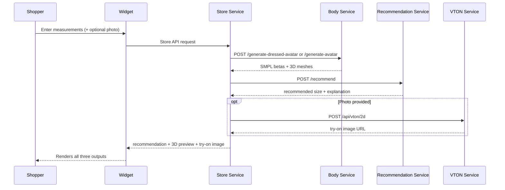
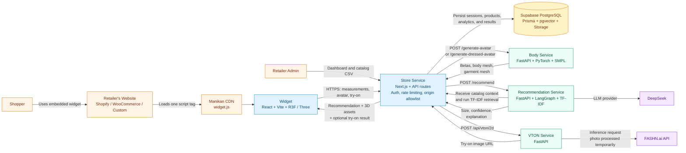

<div align="center">

<table align="center">
  <tr>
    <td align="center" bgcolor="#ffffff">
      
    </td>
  </tr>
</table>

### AI-powered size recommendation & virtual try-on for online fashion.

[](https://www.typescriptlang.org/)
[](https://www.python.org/)
[](https://nextjs.org/)
[](https://fastapi.tiangolo.com/)
[](https://turbo.build/)
[](https://www.prisma.io/)
[](https://supabase.com/)
[](https://www.docker.com/)
[](#-license)

[Overview](#-overview) · [Architecture](#-architecture) · [Getting Started](#-getting-started) · [API](#-service-apis) · [Team](#-team) · [Roadmap](#-roadmap)

</div>

---

## 📌 Overview

**Manikan** is a B2B SaaS widget that fashion e-commerce retailers embed directly into their store. Shoppers enter body measurements and can optionally provide a photo to get:

- ✅ An AI-generated **size recommendation** with a plain-language explanation
- 🧍 A **3D body + garment preview**, scaled to their actual body shape
- 📸 A realistic **2D virtual try-on** image, when a photo is provided

> **The problem:** poor fit is a major driver of online fashion returns and reverse-logistics cost. Every brand sizes differently, and shoppers have no reliable way to predict fit before buying. Manikan addresses this problem, starting with the MENA / Egypt market.

|                           |                                                                                                                       |
| ------------------------- | --------------------------------------------------------------------------------------------------------------------- |
| 🎯 **Who it's for**       | **Retailers** (B2B) embed & manage it · **Shoppers** (B2C) use it for free                                            |
| 💰 **Business model**     | B2B SaaS — retailers pay to embed the widget                                                                          |
| 🌍 **Primary market**     | MENA region, Egypt-first                                                                                              |
| ⚡ **Integration target** | An embeddable `<script>` tag is the target integration; the current widget package is still a standalone demo harness |

---

## 🔄 How It Works



The widget **never** talks to the Body, Recommendation, or VTON services directly — every request is routed and validated through the Store Service, the single orchestration and security boundary of the system.

---

## ✨ Core Features

<table>
<tr>
<td width="50%" valign="top">

### 📏 Size Recommendation

Core MVP feature. Shopper enters height, weight, chest, waist, and optional hip measurements. The recommendation service uses deterministic size-chart matching for sizing and a LangGraph-based multi-provider agent for conversational discovery.

### 🧵 Virtual Try-On

Shopper photo + garment image → a realistic try-on image via the FASHN.ai Try-On Max API. The service uses temporary files and cleanup controls; external provider retention is governed by FASHN.ai's policy.

</td>
<td width="50%" valign="top">

### 🧍 3D Body + Garment Preview

A SMPL body mesh (inner layer) rendered together with a parametric garment shell (outer layer) that scales automatically with the shopper's body shape — a fast geometric approximation, not cloth simulation.

### 📦 Catalog Ingestion & Dashboard

Retailers upload a CSV catalog, which is parsed, validated, embedded, and stored in pgvector. A dashboard surfaces usage analytics, catalog management, widget customization, and billing.

</td>
</tr>
</table>

---

## 🏗 Architecture



The Store, Body, Recommendation, and VTON units are separate services. The current Docker Compose deployment covers the Store and Body services; the Python Recommendation and VTON services have their own local/container workflows and are deployed separately.

---

## 🧰 Tech Stack

| Layer                              | Technology                                                               | Notes                                                                                           |
| ---------------------------------- | ------------------------------------------------------------------------ | ----------------------------------------------------------------------------------------------- |
| **Widget**                         | React 19, TypeScript, Vite, Tailwind CSS, `@react-three/fiber` / `three` | Current package is a standalone demo app; `build:lib` is available for the planned embed bundle |
| **Dashboard + API**                | Next.js 16, TypeScript                                                   | SSR + API routes in one app                                                                     |
| **ORM**                            | Prisma                                                                   | Type-safe queries + migrations                                                                  |
| **Database**                       | Supabase (PostgreSQL)                                                    | Managed Postgres, auth, storage                                                                 |
| **Catalog retrieval**              | TF-IDF + cosine similarity                                               | In-memory retrieval over catalog context supplied to the recommendation service                 |
| **Payments**                       | Stripe                                                                   | Retailer billing                                                                                |
| **Email**                          | Resend                                                                   | Transactional email                                                                             |
| **Store hosting target**           | Vercel                                                                   | Planned deployment target                                                                       |
| **Body Service**                   | Python, FastAPI, PyTorch, SMPL                                           | Research license (ITI); commercial license required pre-launch                                  |
| **Recommendation Service**         | Python, FastAPI, LangGraph, TF-IDF, DeepSeek                             | Deterministic sizing plus conversational product discovery                                      |
| **Observability target**           | Langfuse                                                                 | Planned; verify configuration before relying on traces                                          |
| **VTON Service**                   | Python, FastAPI, FASHN.ai Try-On Max                                     | No GPU required on our side                                                                     |
| **Python services hosting target** | Railway                                                                  | Planned deployment target                                                                       |
| **Containerization**               | Docker (every service)                                                   | Local/prod parity                                                                               |
| **Monorepo tooling**               | Turborepo, npm workspaces                                                |                                                                                                 |

---

## 📁 Monorepo Structure

```
monorepo/
├── apps/
│   ├── store/                  Next.js 16 — Store Service + Retailer Dashboard (orchestrator)
│   ├── widget/                 React + Vite — embeddable shopper-facing widget
│   └── docs/                   Docs app
├── services-python/
│   ├── body-service/           FastAPI + SMPL — 3D body & garment mesh generation
│   ├── recommendation-service/ FastAPI + LangGraph — size recommendation agent (RAG)
│   └── tryon-service/          FastAPI + FASHN.ai — 2D virtual try-on
├── packages/
│   ├── ui/                     Shared React component library
│   ├── eslint-config/          Shared ESLint configs
│   └── typescript-config/      Shared tsconfig.json bases
├── infra/                      Caddyfile, docker-compose (production), env templates
├── manikan-bot/                Python bot/testing utilities
├── MANIKAN_PROJECT.md          Full internal project & architecture reference
└── turbo.json / package.json   Turborepo pipeline + workspace config
```

The widget is currently a standalone development/demo application, not yet a finished retailer embed bundle. Use each service README and the available environment templates for current setup details. Body configuration is provided through `infra/env/body.env.example`; there is currently no Body or VTON `.env.example` file in their service directories.

---

## 🚀 Getting Started

### Prerequisites

- Node.js `>= 18`
- npm `^11`
- Python `3.11` (required by the Body Service's SMPL/PyTorch dependencies; the other services have their own requirements)
- Docker (recommended for local parity with production)
- Access to: Supabase project, the LLM provider credentials required by the Recommendation Service, FASHN API key, Stripe test keys, and Langfuse project as applicable

### Install

```bash
git clone https://github.com/manikan-tech/monorepo.git
cd monorepo
git checkout develop
npm install
```

### Run everything (TypeScript apps)

```bash
npm run dev
```

### Run a single app

```bash
npx turbo dev --filter=store
npx turbo dev --filter=widget
```

### Run the Python services

Each service expects its own virtualenv at `.venv` inside its folder.

```bash
# Body Service            → http://localhost:8001
npm run start:body

# Recommendation Service  → http://localhost:8002
npm run start:ai

# VTON Service            → http://localhost:8003
npm run start:vton
```

Or manually, per service:

```bash
cd services-python/body-service
python -m venv .venv && source .venv/bin/activate
pip install -r requirements.txt
uvicorn app.main:app --reload --port 8001
```

### Docker (Store + Body production-style topology)

```bash
docker compose --env-file infra/env/compose.env -f infra/compose.production.yml up --build
```

This Compose file runs Caddy, Store, and Body. It does not start the Recommendation or VTON services. For the full local flow, start those services separately with the commands above and configure their internal URLs/keys in the relevant environment files.

---

## 🔐 Environment Variables

Copy the example files and fill in real values before running anything:

```bash
cp apps/store/.env.example       apps/store/.env
cp apps/widget/.env.example      apps/widget/.env
cp infra/env/body.env.example    infra/env/body.env
cp infra/env/compose.env.example infra/.env
cp infra/env/store.env.example   infra/env/store.env
```

The Store requires database, Supabase, authentication, internal service keys, image-host allowlists, and Stripe values. The Recommendation Service has its own provider and service-auth template. The VTON service requires `FASHN_API_KEY`; its deployment configuration is described in its README. See [apps/store/.env.example](apps/store/.env.example), [services-python/recommendation-service/.env.example](services-python/recommendation-service/.env.example), and [infra/env/body.env.example](infra/env/body.env.example).

> ⚠️ Never commit real `.env` files — only `.env.example` templates belong in git.

---

## 📜 Available Scripts

| Command                      | Description                                        |
| ---------------------------- | -------------------------------------------------- |
| `npm run build`              | Build all apps/packages via Turborepo              |
| `npm run dev`                | Run all TypeScript apps in dev mode                |
| `npm run lint`               | Lint all workspaces                                |
| `npm run check-types`        | TypeScript project-wide type checking              |
| `npm run format`             | Prettier across `.ts`, `.tsx`, `.md`               |
| `npm run start:body`         | Run the Body Service locally (port 8001)           |
| `npm run start:ai`           | Run the Recommendation Service locally (port 8002) |
| `npm run start:vton`         | Run the VTON Service locally (port 8003)           |
| `npm run upload:seed-images` | Seed demo product images into storage              |

You can scope any Turborepo task with `--filter=<app-name>`, e.g. `turbo build --filter=store`.

---

## 🔌 Service APIs

<details open>
<summary><strong>Store Service</strong> — <code>apps/store</code> — the only service the widget calls</summary>

```
POST /api/widget/recommend        recommendation proxy used by the current widget
POST /api/products/upload-csv       ingest retailer CSV
POST /api/tryon                   auth-gated proxy to Body Service /generate-dressed-avatar → streams .glb
POST /api/avatar                  auth-gated proxy to Body Service /generate-avatar → streams bare-body .glb
GET  /api/retailer/analytics      dashboard usage stats
```

</details>

<details>
<summary><strong>Body Service</strong> — <code>services-python/body-service</code></summary>

```
GET  /health
POST /generate-avatar             measurements → binary bare-body .glb
POST /generate-dressed-avatar     measurements + garment data → binary dressed .glb
```

</details>

<details>
<summary><strong>Recommendation Service</strong> — <code>services-python/recommendation-service</code></summary>

```
GET  /health
POST /recommend                   deterministic sizing or conversational recommendation
Input:  session, messages, measurements, product/size-chart context, and catalog context
Output: action, reply, recommendation fields, provider, and optional product ids
```

</details>

<details>
<summary><strong>VTON Service</strong> — <code>services-python/tryon-service</code></summary>

```
GET  /health
GET  /capabilities
POST /api/vton/2d                  multipart human image + garment image URL + category
Output: generated PNG file or structured HTTP error
```

</details>

See each service's own `README.md` and `MANIKAN_PROJECT.md` for full request/response contracts.

> **Current integration status:** the widget's 2D upload client currently calls the Store route `/api/widget/vton`, while the internal VTON worker contract is `/api/vton/2d`. These paths and their authentication headers still need to be aligned before the photo try-on flow can be considered end-to-end verified.

---

## 🗄 Database Schema (simplified)

```prisma
model Retailer {
  id       String   @id @default(cuid())
  name     String
  apiKey   String   @unique
  products Product[]
  sessions MeasurementSession[]
}

model Product {
  id         String  @id @default(cuid())
  retailerId String
  name       String
  category   String  // blouse | pants | shirt | skirt
  gender     String
  brand      String
  fabric     String
  priceEgp   Float
  imageUrl   String
  embedding  Unsupported("vector(1536)")?
  variants   ProductVariant[]
}

model ProductVariant {
  id        String @id @default(cuid())
  productId String
  sizeLabel String  // S | M | L | XL | XXL
  chestCm   Float?
  waistCm   Float?
  hipCm     Float?
  lengthCm  Float?
  inseamCm  Float?
}

model MeasurementSession {
  id              String   @id @default(cuid())
  retailerId      String
  heightCm        Float
  weightKg        Float
  chestCm         Float
  waistCm         Float
  bodyShapeParams Json?    // SMPL betas
  recommendedSize String?
  confidenceScore Float?
  explanation     String?
  tryonResultUrl  String?  // never the raw shopper photo
  createdAt       DateTime @default(now())
}
```

---

## 🛡 Security & Privacy

- **Shopper photos are not retained by Manikan as permanent assets.** The VTON Service normalizes uploads, uses temporary files during processing, and cleans them up. External provider retention is governed by the provider's policy and must be reviewed before production.
- All measurements are stored in metric units — unit conversion happens client-side in the widget only.
- Measurement and recommendation records retain the data needed to explain the result; schema details can change during the MVP.
- Internal services are never reachable from the widget directly — all traffic is proxied and validated by the Store Service (API key header, fail-closed origin allowlist, rate limiting, tenant checks).
- Docker + `.dockerignore` / `.gitignore` are configured per service — double-check before adding new secrets.

---

## 👥 Contributors

The following identities are represented in the repository history. Add or update the links if the official graduation-project team roster differs from the commit history.

| GitHub                                                   | Name             |
| -------------------------------------------------------- | ---------------- |
| [@HashimAbdulaziz](https://github.com/HashimAbdulaziz)   | Hashim Abdulaziz |
| [@AlaaAbdullah13](https://github.com/AlaaAbdullah13)     | Alaa Abdullah    |
| [@Mostafa-Khalifaa](https://github.com/Mostafa-Khalifaa) | Mostafa Khalifa  |
| [@HaneenElasawy](https://github.com/HaneenElasawy)       | Haneen Elasawy   |
| [@muhamedhaamdy](https://github.com/muhamedhaamdy)       | Mohamed Hamdy    |

---

## 🗺 Roadmap

### ✅ Foundation

- [x] Repo structure + GitHub team access
- [x] API contracts documented
- [x] DB schema + first Prisma migration
- [x] Store, Body, Recommendation, and VTON services scaffolded

### 🚧 MVP Completion

- [x] Core Store, Body, Recommendation, and VTON request paths are implemented and documented
- [ ] Complete and verify the local end-to-end flow: measurement → body prediction → size recommendation → optional try-on
- [ ] Add automated API contract and integration tests for the Store, Body, Recommendation, and VTON services
- [ ] Verify failure handling, timeouts, rate limiting, origin validation, and shopper-photo deletion

### 🧪 Staging Validation

- [ ] Deploy the Store to Vercel and validate the widget demo/build output
- [ ] Deploy the Python services to Railway
- [ ] Verify the complete flow in staging with a seeded retailer catalog
- [ ] Confirm observability with service logs and Langfuse traces

### ✨ Product Readiness

- [ ] Widget UI polish + cross-browser embed testing
- [ ] Dashboard UI polish (analytics, billing via Stripe)
- [ ] Demo script & seeded demo retailer catalog

### 🚀 Production Launch Gates

- [ ] Security, privacy, consent, and production-readiness review
- [ ] Commercial SMPL license obtained before any real-money launch
- [ ] Production launch approval after staging results and launch-gate review

---

## 🤝 Contributing

1. Branch off `develop`: `git checkout -b feat/<short-description>`
2. Keep changes scoped to one app/service where possible — Turborepo only rebuilds/tests what's affected
3. Run `npm run lint && npm run check-types` before opening a PR
4. Update the relevant service's `README.md` / `.env.example` if you add new configuration
5. Open a PR into `develop`; production releases are cut from `main`

---

## 🧭 Key Design Decisions

1. **The current widget uses the Store proxy for recommendation and Store APIs for 3D flows** — internal Python services should remain private and server-to-server.
2. **All measurements stored in metric** — conversion happens client-side only.
3. **`measurementVersion` on every session** — protects data integrity as measurement instructions evolve.
4. **Catalog data stays in PostgreSQL** — keeps infrastructure simple; recommendation retrieval currently uses in-memory TF-IDF over request context rather than a dedicated vector database.
5. **Shopper photos are not retained as permanent Manikan assets** — temporary processing files are cleaned up, while external provider retention follows the provider policy.
6. **3D preview is two separate layers, not one mesh** — a SMPL body mesh (constant per shopper) plus a parametric garment shell (changes per category), rendered together but generated/stored independently. This is a geometric approximation, not cloth simulation.
7. **Parametric garment shapes derive from SMPL betas, not hardcoded values** — the garment shell scales automatically with the shopper's body shape.
8. **SMPL is used under a research license for ITI** — a commercial license is required before any real-money launch.

See `MANIKAN_PROJECT.md` for the full internal reference this README is derived from.

---

## 📄 License

Private / proprietary — internal ITI graduation project. Not currently licensed for external use or redistribution. Update this section once a license is decided.

<div align="center">

_Manikan Team · Egypt-first virtual fitting for online fashion._ 🇪🇬

</div>
