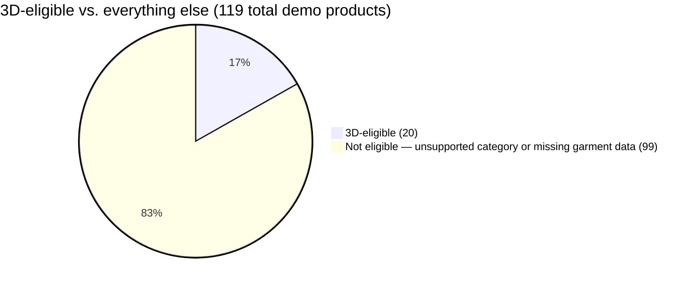

# 3D Body Modeling & Try-On

A shopper enters five measurements and a sex, and gets back a real SMPL avatar — a rigged 3D mesh sized to *their* body, not a template — wearing the actual garment, rendered live in the browser. This is a different technique from the [2D Virtual Try-On](/docs/services/vton) service: VTON is photo-to-photo synthesis through a third-party API; this is a differentiable optimisation that solves for the body's own shape parameters, running on infrastructure Manikan owns end-to-end. It's also the engine behind the [T-Shirt](/docs/garments/tshirt), [Pants](/docs/garments/pants), and [Combined Outfits](/docs/garments/combined-outfits) pipelines already documented here — this page is the service view of that same engine: how a retailer turns it on, what the Store's proxy actually enforces, and what it looks like end-to-end for a real shopper.

:::warning
**A word on how this doc came to be, and two bugs it caused.** Every claim below was checked against the running code, and the live shopper session in §5 is real output from this session's own local stack — not mockups. Getting there surfaced two genuine, live bugs, both **fixed in the course of writing this page**, both cited with before/after: the widget's product-lookup route was gated to the wrong service scope (§1), and the body-modeling engine itself had no internal key configured, so it was fail-closed rejecting even the Store's own correctly-authenticated requests (§4). A third, related bug was found and left **open** — a stale fallback key hardcoded into the Store's own first-party storefront button (§4) — because fixing it means rotating a key other flows may depend on, which isn't a call to make silently while writing documentation.
:::

## What's done, what's open — right up front

| | Status |
|---|---|
| SMPL shape-optimisation engine (`body-service`) | Done, live-verified — real Adam optimiser over 10 β parameters, not a template lookup |
| Physics-baked garment drape | Done for **male tees only** by default; pants drape ships but is off by default for both sexes |
| Store proxy + per-service key auth | **Enforced**, fail-closed, verified live this session |
| Retailer key generation + embed snippet | Done, real dashboard UI — but the snippet's advertised CDN host doesn't exist (§1) |
| `/api/widget/products/[id]` service-scope bug | **Fixed this session** — was gated to `RECOMMENDATION`, needed `BODY_MODELING` (§1) |
| `body-service` missing its own internal key | **Fixed this session** — the running process had no `BODY_SERVICE_KEY`, so it fail-closed on every request (§4) |
| Stale hardcoded fallback key in the storefront's own "3D Fit Preview" button | **Open, live, not fixed** — see §4 |
| Combined outfits (tee + pants in one render) | Engine-complete, **not reachable from the shipped widget** (§6) |
| 3D-eligible demo catalogue | 20 of 119 products (6/6 tees, 14/46 pants, 0 of everything else) — §7 |

## 1. Get a key, drop in a script tag — the retailer's actual integration

The pitch to a retailer is genuinely that simple: one dashboard page, one key, one `<script>` tag. Here's exactly what that looks like, verified against the real UI and route code rather than described from memory.

A logged-in retailer opens **Services → Body Modeling** (`/dashboard/services/body-modeling`, `apps/store/app/dashboard/services/body-modeling/page.tsx`). The key panel on that page (`ServiceKeyPanel.tsx`, shared by all three services) does four things:

1. **Lazily provisions a key on first load.** `GET /api/retailer/widget-key/BODY_MODELING` (`apps/store/app/api/retailer/widget-key/[service]/route.ts:83-90`) upserts a `ServiceApiKey` row the first time the page is opened — there's no separate "activate 3D try-on" step to remember.
2. **Shows the real, copy-pasteable embed snippet** (`ServiceKeyPanel.tsx:154`):

   ```html
   <script src="https://widget.manikan.tech/v1/embed.js"
           data-retailer-key="pk_live_…"
           data-product-id="PRODUCT_ID"></script>
   ```

3. **Regenerate Key** — rotates the key immediately (`POST` on the same route), which instantly invalidates the old one everywhere (`apiKey` is `@unique`), with an explicit in-UI warning that any live embed using the old key will start failing.
4. **Allowed Origins** — add/remove the domains the widget is permitted to run on, normalized to `scheme://host[:port]` and stored on `Retailer.widgetSettings.allowedOrigins` — the same allowlist all three services share, since it's one storefront domain regardless of which services are active.

The key itself is `generatePublicKey()` (`apps/store/app/lib/service-keys.ts:19-21`) — Stripe-style, `pk_live_${randomBytes(24).toString("hex")}` — and it's scoped to exactly one service. A retailer who also wants the [Recommendation widget](/docs/architecture/main-store) or [2D VTON](/docs/services/vton) gets a **separate** key for each, from the same panel pattern on their own dashboard pages, each with its own independent subscription and quota.

:::warning
**Two real gaps in this flow, found by actually trying to use the snippet — one fixed live, one still open.**

**Fixed this session:** the snippet's auto-init path resolves `data-product-id` by calling `GET /api/widget/products/[id]` (`apps/widget/src/lib/products.js:18-30`). That route was gated with `authorizeWidgetRequest(request, CORS_HEADERS, "RECOMMENDATION")` (`apps/store/app/api/widget/products/[id]/route.ts`, prior to this session) — **not** `"BODY_MODELING"`, even though its own comment claimed *"gated by the SAME auth as `/api/tryon`"* and the only two real callers of the route (the widget's product picker and its embeddable auto-init path) both go straight into `/api/tryon`, which *is* `BODY_MODELING`-scoped. A retailer who followed the dashboard's own instructions — generating only a `BODY_MODELING` key and pasting the snippet above — got a widget that opened, then failed to load the product with a silent 403. Both the auth check and the quota-deduction call three lines later (`consumeQuota(auth.subscription.id, "RECOMMENDATION")`) were mislabeled the same way; both are now `BODY_MODELING`.

**Still open:** `https://widget.manikan.tech/v1/embed.js` — the exact host the dashboard tells every retailer to embed — **is not a real, deployed CDN.** It appears in exactly two places in this repo: this dashboard page and the Recommendation service's equivalent (`.../v1/recommend.js`), and nowhere else — no Terraform, no CDN config, no deploy step targets that hostname. The widget bundle that actually works is `apps/store/public/manikan-widget.js` (1.2MB), built by `apps/widget`'s own `npm run build:lib` and **manually copied** into the Store's `public/` folder — there is no automated build step wiring the two together. The Store's own first-party product page loads it same-origin, from `/manikan-widget.js`, not from the CDN URL its own dashboard advertises to retailers.
:::

## 2. The Store's proxy role — verified against the running code

This service follows the same trust model as everything else behind the Store, documented in full in [Main Store Service](/docs/architecture/main-store): the widget on a retailer's page holds a **public**, recognizable key (`pk_live_…`) paired with a fail-closed Origin check; the Store itself holds a **private**, server-to-server key that only it ever sends, and `body-service` rejects anything without it. The Store is the only party that holds both halves — the widget never talks to `body-service`'s `:8001` directly, by design, not by accident (`apps/widget/src/lib/api.js:1-8` cites this explicitly).

```flow
actor S: Shopper's browser (widget)
actor P: Store proxy (/api/tryon)
actor D: Postgres (product + garment data)
actor B: body-service :8001 (/generate-dressed-avatar)

S -> P: X-Manikan-Key (public, BODY_MODELING-scoped) + Origin + measurements + product_id + size
P -> P: authorizeWidgetRequest() — key, Origin allowlist, quota, rate limit
P -> D: Resolve product + variant for THIS retailer only (tenant isolation, 404 not 403)
P -> D: Optional also_wear: resolve the second garment the same way
P -> B: X-Manikan-Internal-Key (private) + measurements + resolved garment data
B -> B: Solve 10 SMPL β parameters (Adam, ~80 iterations) to match the body's measurements
B -> B: Bind/drape the garment mesh, layer a second garment if present
B -> P: Binary .glb (body + garment as separate glTF nodes)
P -> D: Persist a MeasurementSession (retailerId, shopperRef, sizes, recommendedSize)
P -> S: Streamed .glb, rendered client-side by react-three-fiber
```

Real file, per hop: `apps/store/app/api/tryon/route.ts` (proxy + resolution + persistence), `apps/store/app/lib/widget-auth.ts` (the gate), `services-python/body-service/app/main.py` (the engine). The garment's colour and measurements are always re-resolved from the DB server-side (`apps/store/app/api/tryon/route.ts:59-93`) — a client can request a product/size, never supply its actual fit data, which is what keeps a tampered client payload from changing what gets rendered.

## 3. The SMPL engine itself — an optimiser, not a template swap

`services-python/body-service/` is a FastAPI service (`app/main.py`, 1,574 lines) with its own internal `docs/` folder tracking a real multi-month engineering history. It is the largest, most heavily-engineered piece of the whole 3D pipeline.

**What actually happens on a request**: five measurements (sex, height, weight, chest, waist, hips) go into an Adam optimiser that solves for 10 SMPL β (shape) parameters, minimizing the error between the *user's* circumferences and *actual vertex-ring measurements* taken on the candidate mesh at each step (`solve_betas()`, `app/main.py:304-423`). Landmark indices come from the published DavidBoja/SMPL-Anthropometry project; measurement rings are convex-hull-extracted once per gender at startup. The loss weights mass 10×, waist 5×, chest/hips 2×, plus a shape prior, and stops early once loss drops below 5.0 — default 80 iterations (`OPT_ITERATIONS`, `app/config.py:60`). This is why two different bodies with the same height and weight but different chest/waist/hip ratios come out visibly different, not palette-swapped — confirmed directly in the renders in §5.

| Endpoint | Input | Output |
|---|---|---|
| `POST /generate-avatar` | 5 measurements | Bare A-pose `.glb`, no garment |
| `POST /generate-dressed-avatar` | 5 measurements + category + garment colour/measurements + optional `also_wear` | `.glb` with body + garment as separate nodes (3 nodes if layered) |

Both are `POST`-only, both behind `verify_internal_key` (`app/main.py:596-609`), which is fail-closed by design and accepts either `BODY_SERVICE_KEY` or `BODY_SERVICE_KEY_PREVIOUS` for rotation without downtime. Neither endpoint ever returns JSON, a PNG, or raw measurement numbers — the only output is a binary glTF. There is no server-side rendering anywhere in this service (no pyrender, nothing rasterizes a picture) — every screenshot in §5 is the *browser* (react-three-fiber) drawing the returned mesh live.

**Two rendering pipelines**, chosen per request:
- **Kinematic (Pipeline 1)** — a separately-authored garment mesh bound to the body surface by nearest-triangle + barycentric coordinates + a normal offset, deformed as the body deforms. Always available, the universal fallback.
- **Physics-baked drape (Pipeline 2)** — folds and sag come from a real offline Blender cloth simulation, pre-baked across a 5×5×5 = 125-point body-shape grid and stored as a float16 delta library, bilinearly interpolated at request time. No live physics simulation ever runs on a request.

:::warning
**Gender coverage is asymmetric, and it's a default, not a missing feature.** `USE_PHYSICS_DRAPE` (`app/config.py:48-57`) is on by default only for **male** tees (`app/main.py:1185,1244,1388`) — every female tee request today falls back to the kinematic pipeline. Pants physics ships for both sexes but is **off by default for everyone** (`MANIKAN_PANTS_DRAPE`, unset in every tracked config — see [Pants](/docs/garments/pants)). The female renders in §5 are real and correctly body-shaped, but they're using the simpler binding, not the baked-cloth one the male tee renders get.
:::

**On disk, verified real**: SMPL male/female models, ~53MB each; tee physics delta library, 2.7MB; the kinematic tee template comes from the Multi-Garment Network dataset, which is licensed **non-commercial research use only** — a `NOTICE.md` documents this in the model directory, and it's a real, live licensing exposure for any request that hits the fallback path (every female tee, and any male request where the physics path is disabled or fails), not a hypothetical one.

## 4. Security, verified live this session

| Control | Status | Evidence |
|---|---|---|
| Public key → service scope → active retailer | **Enforced** | `authorizeWidgetRequest()`, `apps/store/app/lib/widget-auth.ts:117-195` |
| Origin allowlist, fail-closed | **Enforced** | Same file, step 2 — a missing Origin (server-to-server caller) is rejected outright |
| Per-service monthly quota + per-retailer rate limit | **Enforced** | Steps 5–6, same function |
| Internal key on `body-service` (`X-Manikan-Internal-Key`) | **Enforced, fail-closed, rotation-aware** | `verify_internal_key()`, `app/main.py:596-609` |
| Tenant isolation on product/variant resolution | **Enforced**, 404 not 403 | `apps/store/app/api/tryon/route.ts:59-93` — another tenant's product id stays unguessable |

:::warning
**Fixed this session: `body-service` had no internal key in its own running environment.** No `.env` existed under `services-python/body-service/` and its process was started as a bare `uvicorn app.main:app --port 8001`, with `BODY_SERVICE_KEY` unset. Per `verify_internal_key`'s own fail-closed design, this made it reject **every** request — including ones from the Store's own correctly-configured proxy, which does have the matching key in `apps/store/.env`. Confirmed directly: with the key missing, a request carrying the Store's real key still got `401 {"detail":"Unauthorized"}`, identical to sending no key at all. Every screenshot in §5 required restarting `body-service` with `BODY_SERVICE_KEY` set to match the Store's own value before a single real render was possible.
:::

:::warning
**Still open: the storefront's own "3D Fit Preview" button ships a stale fallback key.** `Manikan3DTryOn.tsx:44-45` falls back to a hardcoded literal, `pk_live_618be0c3849d6587048cc81bb490c4d10aaf2c72e9e04330`, whenever `NEXT_PUBLIC_MANIKAN_WIDGET_KEY` is unset — which it is, in this checkout. The component's own comment already warns *"this fallback goes stale if that key is ever rotated."* It already has: the real, current, active `BODY_MODELING` key for the demo retailer is a different value entirely. Right now, clicking "3D Fit Preview" on the live storefront in this environment fails with a 403 until a developer sets the real env var. Left open rather than silently patched here, since swapping a hardcoded key is a deploy-config decision, not a documentation fix.
:::

## 5. Running it live — a real shopper session, four bodies

The widget's own flow (`apps/widget/src/components/ManikanWidget.jsx`), exactly as a shopper sees it: **Welcome** → **Measurements** (a male/female toggle plus five sliders: height, weight, chest, waist, hips) → **Generating** (a real request in flight behind a cosmetic phase-text overlay) → **Try-On**, with size pills, a live-computed size recommendation, and — if the shopper already tried on a different-category garment earlier in the same browser session — a **"Also wearing your…"** checkbox that layers the two.

Four bodies were driven through this flow end-to-end this session, each in its own isolated browser context, against the live local stack (Store on `:3000`, `body-service` on `:8001`, widget dev harness on `:3001`):

| Persona | Sex | Height / weight | Chest / waist / hips | Tee recommends | Pants recommend |
|---|---|---:|---:|:-:|:-:|
| Average male | Male | 180cm / 75kg | 98 / 82 / 95cm | **M** | **S** |
| Plus-size male | Male | 176cm / 128kg | 132 / 120 / 122cm | **XXL** | — |
| Slim female | Female | 165cm / 52kg | 82 / 64 / 88cm | **S** | **S** |
| Plus-size female | Female | 168cm / 98kg | 114 / 100 / 120cm | **XL** | **L** |

Each persona tried the tee alone, the pants alone, and — using the widget's own "also wearing" layering, not a staged composite — both together. The size recommendation engine (`recommendedSize`, `ManikanWidget.jsx:47-67`) drives off chest for tops and waist for pants, and visibly adapts: the same navy tee recommends M for the average-male body and XXL for the plus-size one, on the same size chart.

**Male, tee alone (M recommended) vs. plus-size male, tee alone (XXL recommended) — same product, same chart, two real bodies:**


**Male, tee + pants layered together via the widget's "also wearing" toggle, then pants on their own:**


**Female, slim body — tee alone and pants alone, on the women's-cut trouser (a genuinely different pattern from the men's pair above, not a recolour):**


**Plus-size female, tee + women's pants layered together:**


Two real, verified details visible in these renders, not asserted from documentation: the plus-size bodies are visibly wider through the torso and midsection, not just re-scaled uniformly (confirms the optimiser is genuinely fitting chest/waist/hip independently, not just applying a single scale factor to height/weight); and the women's pants product (`pants-f001`, "Curved-Seam Barrel Trouser") is a separately-modeled cut from the men's pair (`pants-001`), not the same mesh recoloured — a real, deliberate catalog decision, not an oversight.

:::tip
**The layering checkbox and the API's `also_wear` field are two different mechanisms, easy to conflate.** What's shown above — "also wearing your Essential Cotton Crew" — is the widget's own session-scoped memory (`apps/widget/src/lib/outfit.js`, `sessionStorage`, keyed by garment category), which decides *whether to send* `also_wear` on the *next* product's request. It genuinely produces the combined render above. What it is **not** is the retailer- or storefront-driven "show these two specific products combined" capability documented in [Combined Outfits](/docs/garments/combined-outfits) — see §6.
:::

## 6. Combined outfits — engine-complete, not reachable from the widget

`/api/tryon` already resolves and forwards `also_wear` exactly as [Combined Outfits](/docs/garments/combined-outfits) describes (`apps/store/app/api/tryon/route.ts:173-210`) — tenant-isolated, category-checked, seam-reconciled on the `body-service` side. The layering shown in §5 *does* exercise this real code path. What's still missing is a way for a retailer or a first-party product page to *deliberately* request "show product A combined with product B" — today, `also_wear` only ever gets populated by the shopper's own incidental browsing order within one session. There's no UI anywhere (dashboard, widget, or storefront) that lets anyone choose a combination on purpose.

## 7. Catalog — what's actually 3D-eligible today

Only two categories can ever be 3D-try-on-eligible: `tshirt` and `pants` (`apps/store/app/lib/tryon-status.ts:10`). Every other category — blouse, shirt, jacket, skirt — returns an empty required-fields list and is permanently ineligible, not pending. Queried live against the seeded demo catalogue:

| Category | Total products | 3D-eligible |
|---|--:|--:|
| T-shirt | 6 | **6** (all unisex) |
| Pants | 46 | **14** (0 of 18 CSV-imported men's, 5 of 5 unisex, 9 of 23 women's) |
| Blouse / jacket / shirt / skirt | 19 / 16 / 20 / 12 | **0** — category not supported at all |



A product needs a garment colour **and** every size variant carrying its category's full flat-measurement set (`isProductTryOnEnabled()`, `apps/store/app/lib/tryon-status.ts:53-67`) — most of the bulk CSV-imported pants lack that tech-pack data, which is why pants eligibility (14/46) is so much sparser than the purpose-built tee fixtures (6/6). This is a much smaller eligible slice than [2D VTON's 113 of 119](/docs/services/vton) — the two services trade off breadth of catalogue against depth of fit fidelity.

## 8. Performance

No load test or latency benchmark was run in this session — the numbers below are cited from the [T-Shirt](/docs/garments/tshirt) and [Pants](/docs/garments/pants) docs, where they were actually measured, not re-run here.

| Metric | Value | Source |
|---|---|---|
| Male tee, physics-drape path, mean latency | 900.6ms (p95 973.3ms), 15 sequential requests, i7-8850H | [T-Shirt](/docs/garments/tshirt) §Benchmarks |
| Concurrency scaling | Flat ~1.1–1.4 req/s from 1→8 concurrent workers — PyTorch's own intra-op parallelism already saturates all 6 cores within one request | Same |
| Pants physics path | **No equivalent benchmark exists** — ships off by default, so nothing exercises it in production | [Pants](/docs/garments/pants) |
| SMPL model footprint | ~53MB × 2 sexes, resident in memory once loaded | `app/main.py:431,452-480` |

## 9. What wasn't real, stated plainly

- **The CDN host in every retailer's embed snippet** (`widget.manikan.tech`) — aspirational, not deployed. See §1.
- **A single shared retailer key across services** — there isn't one; each of `BODY_MODELING`/`VTON_2D`/`RECOMMENDATION` is independently keyed, subscribed, and quota'd.
- **Server-side image rendering** — there is none; every render in §5 came from the browser's own WebGL context drawing a returned `.glb`.

Everything else checked out: the optimisation-based fitting, the two-pipeline drape system, the Store's proxy/auth chain, and the DB-backed garment field requirements are real, running code with live evidence behind every claim above.

## Roadmap

- **Rotate the storefront's stale fallback key** (§4) and wire `NEXT_PUBLIC_MANIKAN_WIDGET_KEY` into real deployment config so this stops silently going stale on every key rotation.
- **Deploy the actual CDN host** the dashboard already advertises to every retailer, or change the dashboard to advertise the same-origin path that actually works.
- **Give `also_wear` a real trigger** — a retailer- or storefront-driven way to request a specific combination, not just incidental session order (§6).
- **Extend physics-drape to female tees**, and decide deliberately whether pants-drape should default on, rather than leaving both as an unset env var.
- **Grow the 3D-eligible catalogue** past 20 of 119 products — almost entirely a garment tech-pack data-entry gap, not an engine limitation.
