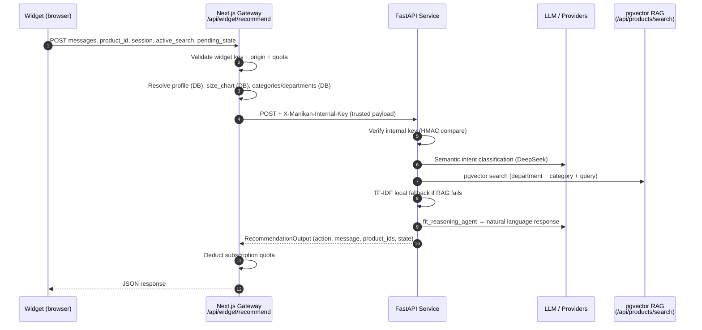
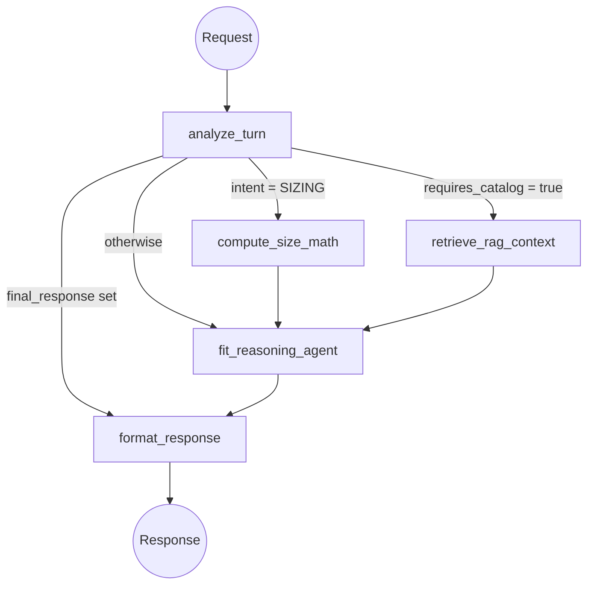

# Manikan Recommendation Service — Technical Reference

> **Status:** Production-ready implementation as of 28 August 2026  
> **Canonical document.** Do not duplicate into other files.

---

## 1. Overview

The Recommendation Service is the AI-powered backbone of Manikan's fashion discovery and sizing experience. It is a standalone FastAPI microservice that:

- Understands natural-language shopping and sizing requests via a semantic classifier (DeepSeek LLM)
- Orchestrates multi-turn conversational state through a LangGraph StateGraph
- Applies hard deterministic constraints (department, category, brand, price, material) **before** any vector/semantic ranking
- Returns structured commands the widget renders as cards, messages, or sizing results

Shoppers interact with it indirectly through the embedded widget. The widget never calls the service directly — all traffic passes through the Next.js store gateway, which enforces authentication, quota, and identity.

---

## 2. Business Purpose

Two distinct modes share the same service:

### General Chat
Shopper explores the catalog by style, department, category, occasion, material, brand, or price. The agent manages multi-turn clarification (missing department, vague category), maintains `active_search` state across turns, and returns product recommendation cards.

### Product Chat
Shopper views a specific product. The agent is anchored to that product and can:
- Answer factual questions (material, brand, description) from authoritative product context
- Execute deterministic size-chart Q&A (e.g., "what is the max chest?")
- Calculate the shopper's exact fit via Euclidean distance sizing math
- Run the confidence flow when a shopper self-reports their size
- Find similar alternatives within the **same category only**

---

## 3. High-Level Architecture



### Trust Boundary

| Layer | Trusts | Does NOT trust |
|---|---|---|
| Widget (browser) | Widget API key grants access | Size chart, profile, product ownership |
| Next.js Gateway | DB as source of truth for size_chart, profile, categories | Widget-supplied size_chart, product_id claims |
| FastAPI Service | X-Manikan-Internal-Key, payload from gateway | Direct browser connections, client-controlled measurements |
| LLM | Conversation context only | Catalog truth, sizing facts, product identity |

---

## 4. Request Lifecycle

1. Widget POSTs `session_id`, `messages`, `product_id`, `active_search`, `pending_state` to `/api/widget/recommend`
2. Gateway validates widget API key (HMAC), CORS origin allowlist, subscription quota
3. Gateway fetches from DB: `size_chart` (CSV), retailer-scoped categories, departments, brands, category→department mapping, shopper profile (name, saved measurements, fit history)
4. Gateway POSTs enriched payload to FastAPI with `X-Manikan-Internal-Key`
5. FastAPI verifies internal key; invokes `recommendation_graph.ainvoke(initial_state)`
6. LangGraph runs: `analyze_turn → [retrieve_rag_context | compute_size_math | direct] → fit_reasoning_agent → format_response`
7. `format_response` serializes `RecommendationOutput` → FastAPI returns to gateway
8. Gateway deducts quota; forwards payload to widget

**What the gateway never accepts from the browser:** `size_chart` data, `retailer_id`, profile measurements, product ownership claims.

---

## 5. LangGraph Workflow



### Node Responsibilities

#### `analyze_turn`
- **Input:** full `FitState` from request
- **Responsibility:** semantic intent classification, pending-state resolution, constraint extraction, static response generation for known deterministic cases
- **LLM call:** `_classify_intent_with_llm` (DeepSeek) → returns JSON with `resolved_intent`, `requires_catalog`, slots
- **Deterministic logic:**
  - Department alias normalization (`_DEPT_ALIAS_MAP`)
  - Category normalization (`_normalize_category_text`, plural collapsing)
  - CATALOG_UNAVAILABLE for concrete product types not in catalog
  - OUT_OF_SCOPE for non-fashion requests
  - AWAITING_DEPARTMENT / AWAITING_CATEGORY pending-state resolution with constraint merging
  - Department auto-inference when category maps to exactly one department
  - Cross-category blocking in Product Chat mode
- **Output mutations:** `resolved_intent`, `requires_catalog`, `selected_category`, `active_search`, `pending_state`, `final_response` (when deterministic)
- **Routes to:**
  - `format_response` when `final_response` is set (deterministic early return)
  - `compute_size_math` when `intent == SIZING`
  - `retrieve_rag_context` when `requires_catalog == True`
  - `fit_reasoning_agent` otherwise

#### `retrieve_rag_context`
- **Input:** `FitState` with `resolved_intent`, `selected_category`, `active_search`, `catalog_products`
- **Responsibility:** candidate retrieval under hard structural constraints
- **Constraint enforcement (always before ranking):**
  1. `department` filter on `catalog_products` (`gender` or `department` field)
  2. `category` filter via `state["selected_category"]`
  3. `brand` filter
  4. `material` / `price` filter (post-filter on retrieved results)
- **Retrieval cascade:**
  1. Remote pgvector endpoint (`/api/products/search?category=...&gender=...&queryText=...`) — 5s timeout
  2. Local TF-IDF cosine similarity on `_filtered_catalog` if remote returns < 4 results
  3. Structural fallback: returns `constrained_catalog` ordered by insertion when TF-IDF scores all zero (handles stemming gaps e.g., "skirts" vs "Skirt")
- **Output mutation:** `retrieved_products` (list of product dicts, max 4)

#### `compute_size_math`
- **Input:** `betas` (MeasurementInput), `size_chart` (JSON string from gateway)
- **Responsibility:** deterministic Euclidean distance matching. LLM is **never involved**.
- **Logic:** Computes distance from user measurements to each size row; returns closest within 15cm threshold. Out-of-range is reported honestly.
- **Output mutation:** `size_math_result` (SizeMathResult)

#### `fit_reasoning_agent`
- **Input:** full `FitState` with retrieved products, size_math_result, intent
- **Responsibility:** natural language generation from deterministic facts. LLM produces only text — never product truth.
- **Deterministic paths (no LLM):**
  - SELF_AWARENESS → `_answer_self_awareness_question(has_product=...)`
  - PROFILE → LLM call with authoritative profile facts only (field-specific)
  - CURRENT_PRODUCT → `_answer_current_product_fact` (material, brand, description, sizes, details) → chart Q&A (`_resolve_chart_answer`) → LLM if no deterministic match
  - Sizing result already computed → LLM narrates the math
  - PRODUCT_DISCOVERY with zero products → STATIC-UNAVAILABLE
- **LLM call:** `call_llm_with_fallback` (DeepSeek) with grounded system prompt
- **Output mutation:** `reasoning_output` (RecommendationOutput)

#### `format_response`
- **Input:** `final_response` (deterministic) or `reasoning_output` (LLM)
- **Responsibility:** serialize to widget-ready output, attach product IDs, normalize action types
- **Normalizations:**
  - FETCH_PRODUCTS with zero product IDs → downgraded to PROVIDE_RECOMMENDATION
  - GREETING/SELF_AWARENESS with REQUEST_DATA action → downgraded to PROVIDE_RECOMMENDATION
- **Output mutation:** `structured_response` (RecommendationOutput with `retrieved_product_ids`, `active_search`, `pending_state`)

---

## 6. Semantic Intent Classification

All intent decisions flow from a single `_classify_intent_with_llm` call. The classifier returns a structured JSON object; deterministic code validates and overrides it where needed.

### Intent Taxonomy

| Intent | Description |
|---|---|
| `GREETING` | Social/emotional expressions — greetings, gratitude, reactions |
| `SELF_AWARENESS` | Questions about the assistant's identity or capabilities |
| `PROFILE` | Questions about the shopper's own saved profile data (name, measurements, fit history) |
| `CURRENT_PRODUCT` | Questions about the product currently being viewed (facts, sizing, description) |
| `SIZING` | Explicit fit calculation request for the shopper's own body |
| `PRODUCT_DISCOVERY` | Browse, search, or shop requests for catalog items |
| `CATALOG_META` | Questions about what the catalog offers (categories, brands) |
| `CONTINUATION` | Follow-up on an active search with the same constraints |
| `CLARIFICATION` | User intent is genuinely ambiguous |
| `CATALOG_UNAVAILABLE` | Valid fashion request for an item not in this catalog |
| `OUT_OF_SCOPE` | Non-fashion, non-shopping topic |

### Extracted Slots

- `requested_department` / `canonical_department` — normalized via `_DEPT_ALIAS_MAP` (man→men, girl→women, etc.; kids/children intentionally not mapped)
- `canonical_catalog_category` — exact catalog category string or null
- `requested_product_type` — open semantic field (may not be in catalog)
- `requested_fashion_concept` — occasion/style/theme (e.g., "wedding", "beach")
- `requested_material`, `requested_brand`, `min_price`, `max_price`
- `requires_catalog`, `is_insufficient_for_retrieval`, `is_human_fashion_request`

---

## 7. Pending State

Multi-turn clarification is managed through `PendingState`:

| Type | Triggered by | Resolved when |
|---|---|---|
| `AWAITING_DEPARTMENT` | PRODUCT_DISCOVERY with no department, multiple departments available | User provides a department synonym or canonical form |
| `AWAITING_CATEGORY` | Department known but concept too broad for category inference | User names a specific category |
| `REQUEST_CONFIDENCE` | User states a size label ("I wear M") | User provides a confidence percentage |
| `CONFIRM_MEASUREMENTS` | Measurement-based sizing path | User confirms or corrects proposed measurements |

**Merge invariant:** When `AWAITING_DEPARTMENT` resolves, the original `active_search.selected_category` is preserved and synced into `state["selected_category"]`. The new department is merged — the search is never rebuilt from the department answer alone.

---

## 8. Active Search

`ActiveSearch` carries the ongoing search context across turns:

```python
class ActiveSearch(BaseModel):
    query: str
    department: Optional[str] = None
    selected_category: Optional[str] = None
    requested_material: Optional[str] = None
    min_price: Optional[float] = None
    max_price: Optional[float] = None
    style_occasion: Optional[str] = None
```

**Lifecycle:**
- Created fresh for new `PRODUCT_DISCOVERY` turns
- Preserved and merged for `CONTINUATION` turns
- Department is **task-local context** — not permanent shopper identity. A fresh product discovery task does not inherit the previous task's department.
- Returned in every response so the widget can round-trip it unchanged

---

## 9. RAG Architecture

Retrieval follows a strict structural-first ordering:

```
1. Structural filter (department + category + brand)
   ↓ constrained_catalog
2. Material + price filter
   ↓ filtered_catalog
3. Remote pgvector search (semantics within constraints)
   ↓ OR (if remote fails/insufficient)
4. Local TF-IDF cosine similarity
   ↓ OR (if TF-IDF scores all zero — stemming gap)
5. Structural fallback: return filtered_catalog directly
```

RAG **never broadens** hard constraints. A query for `category=pants, department=women` will never return skirts.

**Remote retrieval:** `POST /api/products/search` with `{queryText, category, gender}`. Uses `pgvector` HNSW embeddings. Requires the store to be reachable. 5-second timeout.

**Local TF-IDF:** `sklearn.TfidfVectorizer` on name + category + description. No stemmer; hence the structural fallback for plural/morphological mismatches.

**Embeddings:** Embeddings exist in the store's pgvector table. The recommendation service does **not** generate embeddings itself — it calls the store's search API.

---

## 10. Product Chat — Current Product Authority

When `product_id` is present:

- The product is the absolute conversational anchor for the session
- Size chart is resolved server-side (gateway fetches from DB — never from browser)
- Factual questions are answered from `catalog_products` context provided by the gateway
- Sizing math uses the authoritative size chart exclusively
- Cross-category requests are blocked with a redirect message
- "Similar items" retrieval is constrained to `selected_category = current product's category`

---

## 11. Size Chart Q&A (Deterministic)

`_resolve_chart_answer(size_chart_raw, dimensions, operation, for_size)` handles chart dimension questions without any LLM involvement:

| Operation | Example query | Example result |
|---|---|---|
| `max` | "what is the max chest?" | "The largest chest measurement in this chart is 98cm (XL)" |
| `min` | "smallest waist?" | "The smallest waist measurement is 68cm (S)" |
| `range` | "chest range?" | "Chest measurements range from 86cm (S) to 98cm (XL)" |
| `value` | "waist for L?" | "Waist for L is 76cm" |

Dimension aliases: `bust → chest_cm`, `hips → hip_cm`. Numbers are taken directly from the chart JSON — never interpolated or invented.

---

## 12. Deterministic Sizing

`compute_recommended_size` runs Euclidean distance between user measurements and each size row:

1. Measurements (`chest_cm`, `waist_cm`, `hips_cm`) loaded from the gateway-verified profile
2. Distance computed against each size row in the product's size chart
3. Closest row within **15cm threshold** is returned as the recommendation
4. If nearest distance > 15cm, result is `is_out_of_range = True`, `recommended_size = None`
5. LLM receives the numeric result and explains it in human language

The LLM **never decides** the size — it only narrates a decision already made by deterministic math.

---

## 13. Confidence Flow

When a shopper self-reports a size ("I usually wear M"):

1. Agent enters `REQUEST_CONFIDENCE` pending state with the stated size label
2. Shopper provides a confidence percentage ("85 percent")
3. Agent extracts the number via `_CONFIDENCE_PATTERN` regex
4. **If `confidence > 80`:** stated size is trusted; no measurements needed
5. **If `confidence ≤ 80` (including exactly 80):** measurements are requested; deterministic math takes over

The > 80 vs ≤ 80 boundary is enforced in code (`if confidence > 80:`), not by LLM reasoning.

---

## 14. Profile Context

Profile data is supplied by the gateway from the DB and injected as context — not as intent:

- `customer_name`, `saved_measurements`, `previous_product_size`, `recent_fit_history`
- Profile is **context-only**: saved measurements do not automatically trigger sizing; the shopper must explicitly ask
- PROFILE intent routes to a LLM call bounded strictly to profile facts. The LLM cannot invent profile fields.
- If a profile field is requested but not available, the response states it is unavailable

---

## 15. Fallback and Error Handling

| Situation | Provider tag | Message type |
|---|---|---|
| Non-fashion request | `STATIC-OUT-OF-SCOPE` | Deterministic rejection |
| Product type not in catalog | `STATIC-UNAVAILABLE` | Deterministic unavailable |
| Zero matching products | `STATIC-UNAVAILABLE` | Zero-result honest response |
| Cross-category Product Chat request | `STATIC-PRODUCT-SCOPE` | Redirect message |
| LLM classifier threw exception | `STATIC-DEGRADED` | Internal failure (retry) |
| LLM returned empty message | `STATIC-DEGRADED` | Internal failure (retry) |
| CLARIFICATION intent + LLM fails | `STATIC-CLARIFICATION` | Ask to rephrase |
| Known intent + LLM reasoning fails | `STATIC-DEGRADED` | Internal failure (retry) |
| Pipeline produced no output | `STATIC-DEGRADED` | Internal failure (retry) + error log |
| Total pipeline failure (graph exception) | `EMERGENCY-FALLBACK` | Retry message (main.py) |

Internal implementation details (LangGraph, RAG, provider names, API keys) are **never exposed** to the shopper.

---

## 16. API Shape

### Request (`POST /recommend`)

```json
{
  "session_id": "string",
  "messages": [{"role": "user|assistant|system", "content": "string"}],
  "betas": {"height_cm": 0, "weight_kg": 0, "chest_cm": 0, "waist_cm": 0, "hips_cm": 0},
  "product_id": "string | null",
  "product_name": "string | null",
  "profile_context": { "first_name": "...", "saved_measurements": {...}, "recent_fit_history": [...] },
  "size_chart": "JSON string | null",
  "available_categories": ["string"],
  "available_departments": ["string"],
  "available_brands": ["string"],
  "category_department_mapping": {"Category": ["department"]},
  "catalog_products": [{"id": "...", "name": "...", "category": "...", "description": "..."}],
  "pending_state": {"type": "...", "recommended_size": "...", ...},
  "shown_product_ids": ["string"],
  "active_search": {"query": "...", "department": "...", "selected_category": "...", ...}
}
```

Auth: `X-Manikan-Internal-Key` header (verified via HMAC).

### Response (`ChatRecommendResponse`)

```json
{
  "session_id": "string",
  "success": true,
  "reply": "string",
  "action": "provide_recommendation | fetch_products | ask_measurements | request_data | redirect_to_product",
  "recommended_size": "string | null",
  "confidence_score": 0.95,
  "explanation": "string | null",
  "matched_category": "string | null",
  "retrieved_product_ids": ["string"],
  "pending_state": {"type": "...", ...},
  "active_search": {"query": "...", "department": "...", ...},
  "resolved_intent": "string"
}
```

---

## 17. Security Considerations

- **Widget key validation:** `X-Manikan-Key` validated at the gateway. FastAPI drops all requests without `X-Manikan-Internal-Key`.
- **Size chart provenance:** gateway resolves from DB by `product_id + retailer_id`. Client-supplied size charts are rejected entirely.
- **Tenant isolation:** all DB lookups are scoped by `retailer_id` resolved from the widget key — not from the request body.
- **Profile data:** gateway resolves profile from the authenticated session cookie. The service never accesses the DB directly.
- **Prompt injection:** LLM classification and generation run against shopper-supplied text. Grounding rules in the system prompt prevent the LLM from treating user messages as authoritative facts. Deterministic paths bypass LLM entirely.
- **CORS:** gateway enforces allowlisted origins. FastAPI CORS is limited to configured `ALLOWED_ORIGINS`.
- **Rate limiting:** per-session rate limit (10 req/60s) at FastAPI layer; subscription quota deducted at gateway.
- **No secrets in browser:** widget key is public; internal key and LLM API keys are server-only env vars.

**Deployment note:** The widget-facing key is a per-retailer public API key provisioned in the dashboard and stored in `ServiceApiKey` — it is not a shared env var. The internal gateway→FastAPI key (`RECOMMEND_SERVICE_KEY` / `RECOMMENDATION_SERVICE_KEY`) is a separate server-only secret. Keep them distinct in production.

---

## 18. Runtime Dependencies

| Dependency | Purpose | Required? |
|---|---|---|
| `DEEPSEEK_API_KEY` | Primary LLM — classifier + reasoning. Without it every response is `STATIC-DEGRADED`. | Required |
| `RECOMMENDATION_SERVICE_KEY` or `RECOMMEND_SERVICE_KEY` | Internal gateway auth (`X-Manikan-Internal-Key`). Both names accepted (AliasChoices). | Required |
| `RECOMMENDATION_SERVICE_KEY_PREVIOUS` or `RECOMMEND_SERVICE_KEY_PREVIOUS` | Previous internal key, accepted during zero-downtime rotation. | Optional |
| `STORE_BASE_URL` | Base URL of the Next.js store (default: `http://localhost:3000`). Remote pgvector RAG calls go here. | Optional (fallback to TF-IDF) |
| `STORE_SERVICE_BASE_URL` | Override for the store service URL when it differs from `STORE_BASE_URL`. | Optional |
| `STORE_SERVICE_RAG_TIMEOUT_SECONDS` | HTTP timeout for remote RAG calls (default: 5.0s). | Optional |
| `ALLOWED_ORIGINS` | Comma-separated CORS origins (default: `http://localhost:3000,http://127.0.0.1:3000`). | Optional |
| `HF_TOKEN` or `HUGGINGFACE_API_KEY` | Declared in config; not wired to any active code path in the current release. | Optional |

There is **no LLM fallback chain.** DeepSeek is the only LLM provider. If it is unavailable, all LLM-dependent responses fall back to `STATIC-DEGRADED` (classifier) or `EMERGENCY-FALLBACK` (total graph failure) — neither of which exposes the failure reason to the shopper. Retrieval degrades gracefully to local TF-IDF if `STORE_BASE_URL` is unreachable or returns fewer than 4 results.

---

## 19. Testing Strategy

```
tests/
  test_agent.py                   — sizing math unit tests (compute_recommended_size, LLM bypass)
  test_core_invariants.py         — pure-function tests: normalization, chart Q&A, product facts,
                                    confidence scanning, department aliases, TF-IDF retrieval, sizing
  test_e2e_semantic_invariants.py — semantic routing invariants: pending-state flows, CATALOG_META,
                                    department post-filter, show-more exhaustion, full chart Q&A
  test_state_arbitration.py       — category/department/price state arbitration across turns:
                                    single-dept inference, multi-dept unconstrained, stale-state
                                    replacement, CONTINUATION refinement, eligibility gate
  test_live_scenarios.py          — scenarios requiring live environment (excluded from CI)
```

All tests except `test_live_scenarios.py` are deterministic — no live LLM, no network, no DB required. LLM calls are mocked via `AsyncMock` where needed.

Run offline suite: `pytest tests/ --ignore=tests/test_live_scenarios.py -v`

**Coverage gaps (manual E2E only):**
- Full AWAITING_DEPARTMENT → AWAITING_CATEGORY → retrieval multi-turn flow (requires live LLM)
- PROFILE field-specific responses
- Confidence flow 80/81 boundary in full conversation
- Product Chat sizing with real size chart
- Remote pgvector retrieval path

---

## 20. Known Limitations

1. **TF-IDF stemming:** Local fallback has no stemmer. "skirts" and "Skirt" may not match; the structural fallback handles this for zero-TF-IDF-score cases.
2. **15cm sizing threshold:** Globally hardcoded — not configurable per garment category (loose-fit vs slim-fit have different tolerance expectations).
3. **Measurement parsing:** Free-text inline measurements ("I'm 90cm chest, 70cm waist") are not parsed from conversation. Shoppers must use the structured measurement input UI.
4. **Pagination:** "Show more" relies on `shown_product_ids` exclusion in Python — no DB cursor or stateful server-side pagination.
5. **Single LLM provider:** DeepSeek is the only LLM provider. There is no fallback chain — if DeepSeek is unavailable the graph raises, `main.py` catches it, and returns `EMERGENCY-FALLBACK` with a retry message.

---

## 21. Key Design Decisions

- **FastAPI has no DB access.** All trusted data (size chart, profile, categories, product ownership) is resolved by the Next.js gateway and injected. This isolates the AI service from database credentials and prevents LLM-driven DB queries.
- **Structural filtering always precedes semantic ranking.** RAG ranks within constraints; it never broadens them.
- **LangGraph is the single orchestration owner.** There is one response per turn, one state owner per node. No parallel response paths.
- **Deterministic business facts are never LLM decisions.** Product measurements, size chart values, sizing recommendations, and confidence thresholds are all computed in Python.
- **Department is task-local context.** It is not permanent shopper identity. A new shopping task does not inherit the previous task's department.
- **Pending state is a bounded wizard, not a general memory.** It captures exactly one outstanding clarification question; interruptions clear it.
