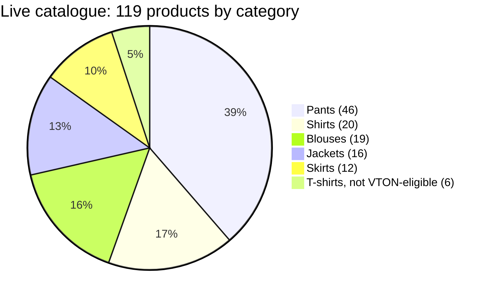
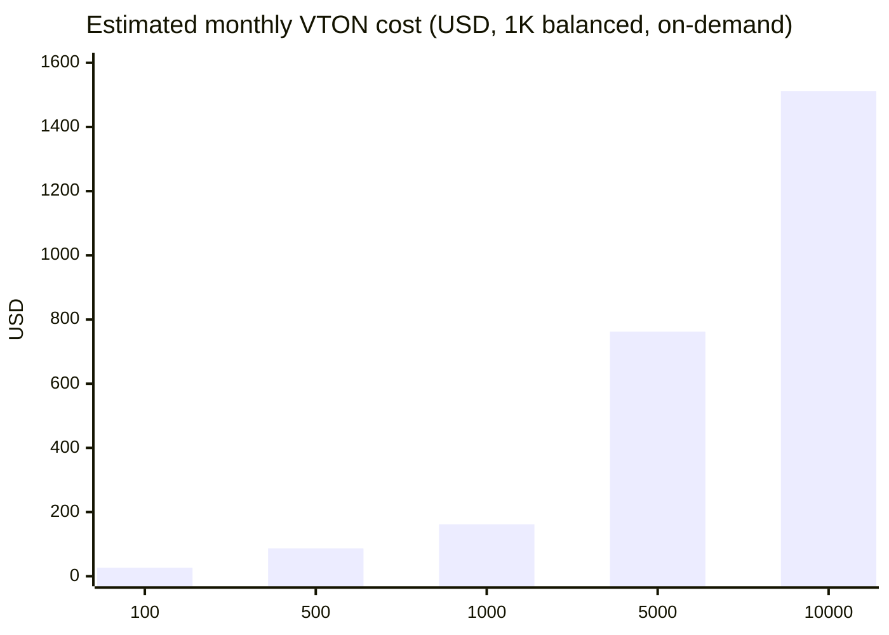

# 2D Virtual Try-On (VTON)

A shopper uploads a photo of themselves, picks a product on the storefront, and gets back a generated image showing that product on their own body — no 3D avatar, no measurements, just a photo in and a photo out. This is a different technique from the [T-Shirt](/docs/garments/tshirt) and [Pants](/docs/garments/pants) pipelines (2D image synthesis via a third-party API, not SMPL mesh fitting), works across six garment categories rather than one, and is built to move the GPU-heavy work off Manikan's own infrastructure entirely.

:::note
**A word on how this document came to be.** It started from an external audit handed to me, dated "as of 17 August 2026," describing a FASHN.ai integration. Checking it against the code I had locally, that integration didn't exist — the service was still running the older OOTDiffusion/Gradio path. Before concluding the audit was simply wrong, I found the real explanation: the FASHN.ai work existed on `origin/develop`, committed by a teammate, just never pulled into this local checkout. Once pulled, every specific technical claim in the original audit — poll intervals, timeouts, retry counts, the category-mapping quirk, the error codes — checked out exactly against the real code. The one place it was genuinely stale wasn't the code, it was the demo catalogue numbers (see §6) — the DB has grown since that section was written. Everything below reflects the current, pulled, verified state.
:::

## What's done, what's open — right up front

| | Status |
|---|---|
| FASHN.ai Try-On Max integration | Done, live-verified (auth gate + validation path tested this session, no billable call made) |
| Internal service-key authentication | **Enforced** — fail-closed, constant-time comparison, rotation-aware (`TRYON_SERVICE_KEY_PREVIOUS`) |
| Storefront gateway (rate limit, session, same-origin) | Done, shipped |
| Worker CORS | **Live, real gap**: wildcard origin reflected with `allow_credentials=True` |
| Store↔worker timeout alignment | **Not aligned** — Store gives up at 90s, worker can legitimately run ~290s+ |
| Load/latency/quality benchmarks | **Do not exist** — no measured data anywhere in this repo, see §7 |
| Demo catalogue, 2D-VTON-eligible products | 113 of 119 seeded products (tshirt is the only seeded category VTON doesn't support) |

## 1. Motivation

Online fashion retail has an information gap: product photos show the garment, not how it looks on the shopper's own body. VTON closes that gap from a single uploaded photo and a retailer-owned product image, without asking for measurements or a 3D avatar.

For retailers, the practical value:
- **More engaging product discovery** — a product becomes something to visualize, not just view.
- **No self-hosted GPU fleet** — FASHN.ai does the inference; the worker orchestrates.
- **Privacy-conscious processing** — the shopper's photo goes to FASHN as a base64 data URI, never persisted as a shopper asset in this worker; temporary local files are deleted after the response.

This is a styling preview, not a fit guarantee — it should never be presented as certifying size, drape, or comfort.

## 2. Architecture

```flow
actor S: Shopper browser
actor G: Storefront gateway (/api/vton/2d/proxy)
actor I: Internal Store route (/api/vton/2d)
actor W: FastAPI VTON worker
actor F: FASHN.ai Try-On Max

S -> G: Multipart human_image + product_id
G -> G: Same-origin check, customer session, 5 requests/customer/hour
G -> I: Server-side request with VTON service key
I -> I: Validate image size, resolve active product, allowlisted HTTPS catalogue host and category
I -> W: Multipart human image, image URL, category
W -> W: Decode, normalize JPEG, validate dimensions
W -> F: POST /v1/run (Bearer key)
F -> W: Prediction ID
loop Every 3 seconds, maximum 30 polls
W -> F: GET /v1/status/{id}
F -> W: starting | in_queue | processing | completed | failed
end
W -> F: Download completed output URL
W -> I: Locally streamed PNG response
I -> G: no-store binary response
G -> S: Generated try-on image
W -> W: Delete UUID-named temporary input/result files
```

| Component | Responsibility | Real file |
|---|---|---|
| Storefront gateway | Browser-facing admission point | `apps/store/app/api/vton/2d/proxy/route.ts` |
| Internal Store route | Trusted orchestration, service-key auth | `apps/store/app/api/vton/2d/route.ts` |
| FastAPI worker | Image validation, FASHN job orchestration | `services-python/tryon-service/main.py` |
| FASHN.ai | Managed inference | `services-python/tryon-service/services/vton_client.py` |

## 3. The FASHN.ai integration

`vton_client.py` is a REST client, not a wrapper around a hosted Gradio Space (that was the previous, now-replaced OOTDiffusion path). Verified directly, both by reading the current code and by hitting the live service:

```python
# services-python/tryon-service/services/vton_client.py
def is_client_initialized() -> bool:
    """Return True if a FASHN_API_KEY is present in the environment."""
    return bool(FASHN_API_KEY)
```

Confirmed live, at zero cost (this check never calls FASHN):

```
$ curl -s http://localhost:8003/health
{"status":"ok","service":"tryon-service","version":"1.0.0","model":"fashn.ai/v1","client_initialized":true}
```

| Function | Role |
|---|---|
| `is_client_initialized()` | Whether `FASHN_API_KEY` is set — no network call |
| `run_tryon(human_img_path, garment_img_path, cloth_type)` | Starts, polls, downloads, returns one local result path |
| `run_tryon_with_retry(..., max_retries=3, wait_seconds=10)` | Retries `RuntimeError` only; `ValueError` (validation) is never retried |

The request uses the current Try-On Max schema — `model_name: "tryon-max"`, `inputs.model_image` + `inputs.product_image` — with the shopper's photo sent as a base64 JPEG data URI and the product image passed as the allowlisted public URL directly.

:::tip
**A real, verified quirk worth knowing: the category is computed but never sent.** `_map_cloth_type_to_fashn_category()` maps the internal `upperbody`/`lowerbody`/`dress` value to FASHN's own vocabulary (`tops`/`bottoms`/`one-pieces`) — but that mapped value is only ever used in a log line (`logger.info("Starting FASHN.ai prediction (category=%s).")`). It never appears in the `payload` dict actually sent to `/v1/run`. The deployed Try-On Max schema simply has no category field. If you're debugging a category-specific quality issue, don't assume FASHN is being told the category — it isn't.
:::

### 3.1 Lifecycle controls, verified against the running service

| Stage | Real value | Verified how |
|---|---|---|
| Human upload minimum | 400 × 600 px | `curl localhost:8003/capabilities` → `min_image_dimensions.human` |
| Product image minimum | 300 × 300 px | same, `.garment` |
| Max upload size | 5 MiB (5,242,880 bytes) | same, `.max_upload_size_bytes` |
| Prediction start | `POST /v1/run`, Bearer auth, 30s timeout | `vton_client.py`, `timeout=30` |
| Status polling | Every 3s, up to 30 attempts (90s ceiling) | `_POLL_INTERVAL_SECONDS = 3`, `_MAX_POLL_ATTEMPTS = 30` |
| Per-poll timeout | 15s | `timeout=15` on the status GET |
| Result download | 60s timeout | `timeout=60` on the image GET |

### 3.2 Error model

| Condition | Real HTTP response | Verified |
|---|---|---|
| Invalid category or image | `400`/`422`, structured code | live: `UNSUPPORTED_CATEGORY` returned for a bad category, see §4 |
| FASHN HTTP/network failure | `502 FASHN_API_FAILURE` | `main.py`, `requests.exceptions.RequestException` handler |
| FASHN failure state, no result, missing key, or poll timeout | `502 FASHN_API_FAILURE`, up to 3 attempts | `RuntimeError` handler |
| Local file/image processing failure | `500 TEMPORARY_IMAGE_PROCESSING_FAILED` | `OSError` handler |

:::warning
**The polling math is real, and it doesn't fit inside the Store's own timeout.** Worst case: 3 attempts × up to 90s of polling, plus two 10-second backoffs between attempts ≈ **290 seconds**, before HTTP/download overhead. The Store's own upstream fetch aborts at a hard **90-second** ceiling (`REQUEST_TIMEOUT_MS = 90_000` in `apps/store/app/api/vton/2d/route.ts`). A shopper's browser can see a timeout while the worker keeps working — and a retry from the browser at that point cannot help a request whose caller already gave up. This is a real, current mismatch, not a hypothetical one.
:::

## 4. Security, verified live this session

| Control | Status | Evidence |
|---|---|---|
| Internal service-key auth | **Enforced** | `verify_internal_key()`, fail-closed, `hmac.compare_digest`, wired as a route dependency on `/api/vton/2d` |
| Customer session + same-origin | Enforced at the gateway | `apps/store/app/api/vton/2d/proxy/route.ts` |
| Rate limit | 5 generations/customer/hour | same file, `CUSTOMER_RATE_LIMIT_MAX = 5` |
| SSRF reduction | HTTPS + allowlisted hostname only | Store internal route, `VTON_ALLOWED_IMAGE_HOSTS` |
| Input normalization | Pillow decode, EXIF-transpose, re-encode RGB JPEG | strips uploaded metadata as a side effect |
| No-store results | `Cache-Control: no-store` at the gateway | reduces accidental caching of personal imagery |

Tested directly against the live worker, both at zero cost (neither request reaches FASHN):

```
$ curl -X POST http://localhost:8003/api/vton/2d -F "human_image=@..." ...
  (no X-Manikan-Internal-Key header)
→ 401

$ curl -X POST http://localhost:8003/api/vton/2d \
    -H "X-Manikan-Internal-Key: <real key>" \
    -F "category=not-a-real-category" ...
→ 422 {"code":"UNSUPPORTED_CATEGORY", ...}
```

:::warning
**A real, still-open gap: worker CORS.** `CORSMiddleware` is configured with `allow_origins=CORS_ORIGINS` (defaults to `["*"]` — no `CORS_ORIGINS` is set in the local `.env`) and `allow_credentials=True`. Starlette doesn't send a literal `*` back when credentials are allowed — it reflects the requesting `Origin` instead. Confirmed live:
```
$ curl -sI http://localhost:8003/health -H "Origin: https://evil.example.com"
access-control-allow-origin: https://evil.example.com
access-control-allow-credentials: true
```
The internal-key gate is what actually stops an unauthorized caller from reaching this worker (CORS only constrains browsers) — but a worker meant to be reached only by the Store's own server should not be advertising itself as credentialed-openly-CORS-permissive to any origin that asks. Tightening `CORS_ORIGINS` to the Store's real origin, or removing the CORS middleware entirely for what is an internal-only worker, is a small, real fix still outstanding.
:::

## 5. Retailer & shopper guide

### Retailer onboarding

1. Publish product images on a stable HTTPS host, then add that host to `VTON_ALLOWED_IMAGE_HOSTS` — never allow arbitrary retailer-supplied URLs.
2. Products must be active and use a supported category: blouse, shirt, jacket, pants, skirt, or dress.
3. Use clean, front-facing product photography at least 300 × 300px.
4. Configure `FASHN_API_KEY` only in the worker's own secret store — never in a browser-reachable env var.

### Shopper experience

1. Open a supported, active product on the storefront and choose Virtual Try-On.
2. Upload a clear, upright photo meeting the displayed size limit.
3. Wait while the preview generates — the result streams back rather than being persisted as a shopper asset by this worker (FASHN's own provider-side retention is governed separately by their policy).
4. Treat the result as a styling preview, not a fit or size certification.


*Real product capture, 17 August 2026 — qualitative evidence that the integrated flow works end-to-end, not a latency or quality measurement.*

### Operational response guide

| Signal | Meaning | First action |
|---|---|---|
| `/health` → `client_initialized: false` | `FASHN_API_KEY` is empty | Restore the secret — this check never validates it remotely, so a *wrong* key still reports `true` |
| `FASHN_API_FAILURE` | Provider/network failure or timeout | Check FASHN's dashboard status and credit balance |
| `UNSUPPORTED_CATEGORY` | Product category outside the 6 supported | Correct the product's category metadata |
| `INVALID_PRODUCT_IMAGE` | Host not allowlisted, or not HTTPS | Move the image or update `VTON_ALLOWED_IMAGE_HOSTS` deliberately |
| `429` at the storefront gateway | Shopper hit the hourly quota | Ask them to wait — don't bypass the limit |

## 6. Demo catalogue — current, live numbers

:::warning
**The catalogue is larger than a CSV-only read would suggest.** `npm run seed` doesn't just import `demo-retailer-catalog-final.csv` — `prisma/seed.ts` also calls `seedDemoTshirts`, `seedDemoPants`, and `seedDemoPantsFemale`, adding fixtures beyond the CSV. Queried directly against the live, freshly-seeded database (not estimated):
:::

| Indicator | Live value |
|---|---:|
| Total products | 119 |
| Size-variant rows | 492 |
| Women / men / unisex | 61 / 47 / 11 |
| Mean price | EGP 999.79 |
| Price range | EGP 490–2,800 |
| Total stock units | 24,600 |
| **2D-VTON-eligible products** (all categories except tshirt) | **113 of 119** |



The CSV import alone (99 products, before the additional seeders run) breaks down as Pants 32 / Shirts 20 / Blouses 19 / Jackets 16 / Skirts 12 — the extra 14 pants (5 unisex + 9 women's, from the two pants seeders) are what separates the CSV-only figure from the live one. Every VTON-eligible product falls in a category the worker accepts; it does **not** mean every image will be permitted in production, since the Store deployment must still allowlist its actual HTTPS host.

## 7. Performance — what's real vs. what isn't

:::note
**No load test, latency sample, or quality score exists anywhere in this repository.** The table below is configuration limits and vendor-published examples, not Manikan measurements. Labeling a synthetic number as a measured result would be a real error, not a rounding choice.
:::

| Metric | Value | Basis |
|---|---|---|
| Poll interval / max polls / window | 3s / 30 / 90s | Worker constants, confirmed above |
| Retry count / delay | 3 attempts / 10s | Worker constants, confirmed above |
| Gateway rate limit | 5/customer/hour | Confirmed above |
| Gateway upstream deadline | 90s | Confirmed above |
| FASHN published examples | ~10s fast/1K, ~25s balanced/2K, ~55s quality/4K | [FASHN Try-On Max reference](https://docs.fashn.ai/api-reference/tryon-max) |

A real evaluation would need a consented test set (≥30 image/product pairs per category), timestamps recorded at every stage in the sequence diagram above, and human-rated fidelity rather than an "accuracy" label that implies a ground truth this task doesn't have. That work hasn't happened yet.

## 8. Cost model

**Assumptions**: a default request (no explicit resolution/mode) bills as FASHN's *balanced* tier — 2 credits at 1K, and FASHN's on-demand rate is $0.075/credit, so one successful request costs **$0.15** in inference. Failed predictions don't consume credits. A minimal worker (2GB Lightsail instance) runs **$12/month**, excluding the Store app, database, and everything else.



| Successful requests/month | FASHN inference | Worker | Total | Per-request |
|---:|---:|---:|---:|---:|
| 100 | $15.00 | $12.00 | **$27.00** | $0.270 |
| 500 | $75.00 | $12.00 | **$87.00** | $0.174 |
| 1,000 | $150.00 | $12.00 | **$162.00** | $0.162 |
| 5,000 | $750.00 | $12.00 | **$762.00** | $0.152 |
| 10,000 | $1,500.00 | $12.00 | **$1,512.00** | $0.151 |

Formula: `requests × $0.15 + $12`. Verified arithmetically consistent, row by row. This is a modeled cost, not a bill — it depends on FASHN's published pricing holding, and on request volume that hasn't happened yet.

## 9. Roadmap

Grounded in what's genuinely open, verified this session — not a wishlist:

- **Tighten worker CORS.** Confirmed live, still open: wildcard origin reflected with credentials on a worker that should only ever hear from the Store.
- **Align the Store↔worker timeout.** 90s Store deadline vs. ~290s worker worst case is a real, confirmed mismatch — pick one end-to-end budget and make the worker cancellation-aware of it.
- **Structured logging with no image/token/base64 payloads**, plus moving secrets to a real secrets manager ahead of any internet-facing rollout.
- **Idempotency and a short-lived result cache** keyed by image/product fingerprint, so a lost response doesn't silently re-spend a FASHN credit.
- **A real evaluation dataset and human-rated quality process** — nothing in §7 is measured yet.
- **Per-retailer metering and provider-credit alarms** before this is exposed beyond the current single demo retailer.
