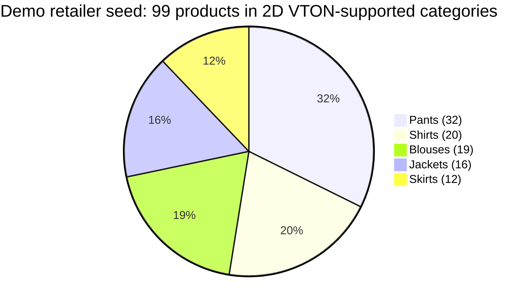
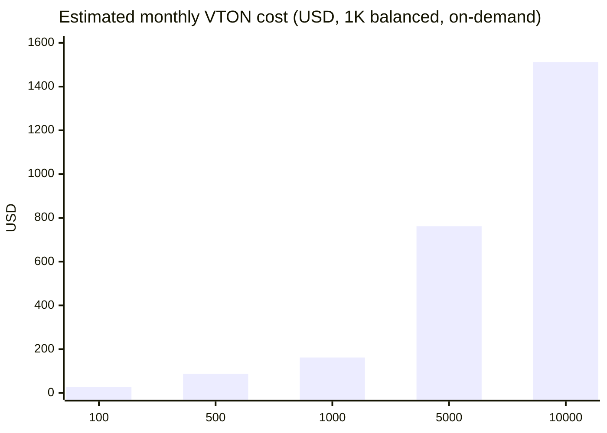

# Manikan Virtual Try-On Service: Technical Report

> **Status:** implementation audit as of 17 August 2026  
> **Scope:** `services-python/tryon-service`, the Store VTON gateway, and the FASHN.ai integration

## Executive summary

Manikan VTON is an AI-assisted fashion visualization capability for e-commerce. A shopper supplies a photograph, selects an active catalogue product, and receives a generated image that visualizes the product on the shopper. The design moves GPU-heavy synthesis to FASHN.ai Try-On Max while retaining Manikan control over product selection, request admission, validation, temporary-file handling, and response delivery.

This is a strong product differentiator: it transforms a static product page into an interactive fitting experience, helping retailers present garments with greater confidence before purchase. The service is particularly suited to catalogue exploration, campaign previews, and a premium digital fitting-room experience; it must not be presented as an exact sizing, fit, or medical/body-measurement guarantee.

The current implementation has a complete FASHN.ai prediction lifecycle and a protected browser gateway. Before an internet-facing production rollout, the FastAPI worker itself must enforce the internal service credential and restrictive CORS; the currently injected header is not validated in `main.py`.

## 1. Motivation and value proposition

Online fashion retail has an information gap: product images show the garment, but shoppers need an intuitive sense of how it may look on a person. Manikan VTON addresses this gap by creating a personalized visual preview from a shopper photograph and a retailer-owned product image.

For retailers, the feature offers a practical premium capability:

- **More engaging product discovery:** an active product can be visualized rather than only viewed as a flat catalogue image.
- **Controlled catalogue usage:** the browser selects a product identifier, while server-side code resolves the canonical image URL and category from the database.
- **No self-hosted GPU fleet:** the worker orchestrates an external inference API, reducing operational complexity and allowing the platform to scale independently of model compute.
- **Privacy-conscious processing:** shopper input is represented as a base64 data URI when submitted to FASHN.ai, while temporary local files are cleaned after delivery.

## 2. System architecture

### Figure 1 — Request and inference pipeline

```mermaid
sequenceDiagram
    autonumber
    participant S as Shopper browser
    participant G as Storefront gateway<br/>/api/vton/2d/proxy
    participant I as Internal Store route<br/>/api/vton/2d
    participant W as FastAPI VTON worker
    participant F as FASHN.ai Try-On Max

    S->>G: Multipart human_image + product_id
    G->>G: Same-origin check, customer session,<br/>5 requests/customer/hour
    G->>I: Server-side request with VTON service key
    I->>I: Validate image ≤ 5 MiB; resolve active product;<br/>allowlisted HTTPS catalogue host and category
    I->>W: Multipart human image, image URL, category
    W->>W: Decode, normalize JPEG, validate dimensions
    W->>F: POST /v1/run (Bearer key)
    F-->>W: Prediction ID
    loop Every 3 seconds, maximum 30 polls
        W->>F: GET /v1/status/{id}
        F-->>W: starting | in_queue | processing | completed | failed
    end
    W->>F: Download completed output URL
    W-->>I: Locally streamed PNG response
    I-->>G: no-store binary response
    G-->>S: Generated try-on image
    W->>W: Delete UUID-named temporary input/result files
```

### Component responsibilities

| Component | Responsibility | Important controls |
| --- | --- | --- |
| Storefront proxy | Browser-facing admission point | Same-origin enforcement, HttpOnly customer session, 5 requests/customer/hour |
| Internal Store route | Trusted orchestration route | Service-key authorization, 5 MiB upload limit, active-product lookup, HTTPS host allowlist, category normalization |
| FastAPI worker | Image validation and FASHN job orchestration | JPEG normalization, minimum dimensions, bounded polling, local response streaming, cleanup |
| FASHN.ai | Managed virtual try-on inference | Try-On Max asynchronous prediction API |

## 3. Implementation analysis

### 3.1 FASHN.ai migration

The worker replaced the former Gradio/OOTDiffusion client with a REST integration using `requests`. The public Python function interfaces remain stable:

| Function | Role |
| --- | --- |
| `is_client_initialized()` | Returns whether `FASHN_API_KEY` is non-empty; no network call occurs |
| `run_tryon(human_img_path, garment_img_path, cloth_type)` | Starts, polls, downloads, and returns one local result path |
| `run_tryon_with_retry(human_img_path, garment_img_path, cloth_type, max_retries, wait_seconds)` | Retries `RuntimeError` only; validation `ValueError` is not retried |

The implementation uses the current FASHN Try-On Max universal request structure: `model_name: "tryon-max"` plus `inputs.model_image` and `inputs.product_image`. Both inputs may be URLs or data URIs according to the [official FASHN Try-On Max reference](https://docs.fashn.ai/api-reference/tryon-max). The current worker sends the shopper image as a base64 JPEG data URI and passes the permitted public product image URL.

The internal `upperbody → tops`, `lowerbody → bottoms`, and `dress → one-pieces` mapping still executes as input validation and is written to logs. It is **not currently included in the Try-On Max request payload**, because the deployed `tryon-max` schema does not use a category field. This distinction is important when discussing the migration.

### 3.2 Input and lifecycle controls

| Stage | Current implementation |
| --- | --- |
| Human upload | Requires image MIME type; decodes with Pillow; EXIF-transposes; converts to RGB JPEG; minimum `400 × 600` px |
| Product source | Store route resolves an active database product; only configured HTTPS hosts are accepted; worker re-downloads and validates at least `300 × 300` px |
| Prediction start | `POST https://api.fashn.ai/v1/run`, Bearer authorization, 30 s request timeout |
| Completion polling | `GET /v1/status/{id}` every 3 s, 30 attempts, per-poll timeout 15 s |
| Result delivery | First output URL is downloaded with a 60 s timeout, saved as UUID `.png`, then sent as a `FileResponse` |
| Cleanup | Input, product-validation, and generated files are deleted on handled failure or via FastAPI background task after response delivery |

### 3.3 Error model

| Condition | Client/worker result | HTTP response from FastAPI |
| --- | --- | --- |
| Invalid category or invalid image | `ValueError`; no retry | `400` or `422`, structured validation code |
| FASHN HTTP/network failure | `requests.exceptions.RequestException`; no worker-level retry | `502 FASHN_API_FAILURE` |
| FASHN failure state, no result, missing API key, or poll timeout | `RuntimeError`; up to three attempts | `502 FASHN_API_FAILURE` |
| Local file/image processing failure | `OSError` | `500 TEMPORARY_IMAGE_PROCESSING_FAILED` |

The polling ceiling is 30 attempts × 3 seconds = 90 seconds. With the configured three retries and two 10-second backoffs, a worker call can occupy roughly **290 seconds plus HTTP and download time** in the worst case. The Store internal route currently aborts its upstream fetch at 90 seconds. This timeout mismatch is a material operational finding: the browser can receive a timeout while the worker continues processing, and retries cannot reliably improve a request whose caller has already abandoned it.

## 4. Security and privacy assessment

### Implemented controls

| Control | Evidence in implementation | Value |
| --- | --- | --- |
| Customer authentication | Storefront proxy reads the customer cookie session | Prevents anonymous access to expensive generation |
| CSRF boundary | Browser `Origin` must equal the Store application origin | Reduces cross-origin cookie abuse |
| Rate limit | 5 generations per customer per hour | Bounds abuse and provider spend |
| Service-to-service credential | Store routes authorize the internal call and inject a server-only key | Keeps credential out of browser code |
| SSRF reduction | Product URL must use HTTPS and an allowlisted hostname | Avoids arbitrary server-side URL fetching from catalogue data |
| Input normalization | Pillow decodes and rewrites RGB JPEG images | Rejects malformed input and strips uploaded image metadata during conversion |
| No-store results | Gateway responses use `Cache-Control: no-store` | Reduces accidental caching of personal imagery |
| Local lifecycle control | UUID temporary names and background cleanup | Limits retained input/output material on the worker |

### Release blockers and recommended remediations

| Priority | Finding from code audit | Risk | Required action |
| --- | --- | --- | --- |
| P0 | FastAPI `POST /api/vton/2d` does not validate `X-Manikan-Internal-Key` or any `verify_internal_key` dependency | Anyone who can reach the worker can invoke paid inference | Enforce constant-time service-key validation in the worker and deny missing/invalid credentials |
| P0 | Worker CORS allows every origin with credentials | Unsafe browser exposure if network routing changes | Restrict origins or remove CORS entirely for an internal-only worker |
| P1 | Store upstream timeout is 90 s while the worker may retry for ~290+ s | Orphaned work, confusing customer outcome, avoidable cost | Align one end-to-end deadline; cancel/avoid retries after caller deadline |
| P1 | FASHN output is requested as an external URL then downloaded | URL lifespan and third-party retention need governance | Use short-lived signed product URLs; evaluate `return_base64` for sensitive flows |
| P2 | Product image is downloaded once for validation then the original URL is passed to FASHN | Duplicate download and possible source drift | Send a short-lived validated asset URL or use the normalized local image as a data URI |

FASHN documents a hybrid privacy pattern that uses base64 for sensitive model images and URLs for catalogue images; it also documents a `return_base64` option with a shorter output availability window. Review the [FASHN data-retention and privacy guidance](https://docs.fashn.ai/api-overview/data-retention-privacy) with the project’s privacy requirements before production.

## 5. Retailer and shopper guide

### Retailer onboarding

1. Publish each product image on a stable HTTPS catalogue/CDN hostname.
2. Add that hostname to `VTON_ALLOWED_IMAGE_HOSTS` in the Store deployment. Do not permit arbitrary retailer-provided URLs.
3. Ensure products are active and use a supported category: blouse, shirt, jacket, pants, skirt, or dress.
4. Use clean, well-lit product photography at least `300 × 300` pixels; front-facing, unobstructed product shots generally produce a more useful preview.
5. Configure the FASHN API key only in the VTON worker’s secret store; never expose it in browser environment variables.
6. Validate the user experience through the Store’s VTON interface, not by exposing the worker to public traffic.

### Shopper experience

1. Sign in to the retailer Store application.
2. Open a supported active product and choose Virtual Try-On.
3. Upload a clear, upright image that meets the displayed size limit.
4. Wait while the preview is generated; Manikan streams the resulting image rather than persisting it as a shopper asset in this worker. FASHN provider retention is governed separately by its documented policy.
5. Treat the result as a visual styling preview. It does not certify size, fit, drape, comfort, or availability.

### Figure 2 — Manikan live integration evidence


*Source: project-provided Manikan interface capture, 17 August 2026. The figure demonstrates the integrated comparison experience and generated output. It is qualitative evidence of a successful application flow; it is not a latency, accuracy, or load-test measurement.*

### Operational response guide

| Signal | Interpretation | First action |
| --- | --- | --- |
| `/health` returns `client_initialized: false` | Secret is absent or empty | Restore `FASHN_API_KEY`; health does not validate it remotely |
| `FASHN_API_FAILURE` | Provider/network job failure or timeout | Inspect request ID, worker logs, FASHN dashboard status, and current credit balance |
| `UNSUPPORTED_CATEGORY` | Product category is outside the supported set | Correct product category metadata |
| `INVALID_PRODUCT_IMAGE` | Product host is not allowlisted or uses HTTP | Move image to approved HTTPS CDN or update allowlist intentionally |
| `429` at storefront proxy | Shopper reached the hourly quota | Ask shopper to wait; do not bypass the rate limit |

## 6. Demo retailer catalogue analysis

The repository includes a CSV seed for the default demo retailer, **Manikan Official Store**, plus six separate virtual-avatar T-shirt fixtures. The following analysis is computed from `demo-retailer-catalog-final.csv` and the seeder logic. It describes a controlled demonstration catalogue, not production retailer activity, sales, conversion, or demand.

| Seeded catalogue indicator | Value | Interpretation |
| --- | ---: | --- |
| Unique catalogue products | 99 | Product records created from the CSV |
| Size-variant rows | 392 | Average of 3.96 variants per product |
| Synthetic stock units | 19,600 | Seeder assigns 50 units per CSV variant row |
| Women / men products | 52 / 47 | Broadly balanced catalogue coverage |
| Supported 2D VTON categories | 5 of 6 | Blouse, jacket, pants, shirt, and skirt are present; dress is not seeded |
| Mean product price | EGP 928.59 | Arithmetic mean across the 99 distinct seeded products |
| Price range | EGP 490–2,800 | Demonstration catalogue range |

### Figure 3 — Seeded catalogue coverage by product category



| Category | Products | Catalogue share | Mean seeded price (EGP) |
| --- | ---: | ---: | ---: |
| Pants | 32 | 32.3% | 814.84 |
| Shirts | 20 | 20.2% | 765.70 |
| Blouses | 19 | 19.2% | 864.80 |
| Jackets | 16 | 16.2% | 1,515.00 |
| Skirts | 12 | 12.1% | 814.17 |

This seeded mix gives the discussion a useful coverage narrative: all 99 CSV products fall into categories the 2D worker accepts, with jackets forming a premium-priced segment. It does **not** establish that every image will be permitted in production: the Store deployment must still allowlist its actual HTTPS catalogue host. The six `demo-tshirts.ts` fixtures support the separate avatar/widget demonstration and are not counted in this 2D VTON catalogue analysis.

## 7. Performance and benchmark plan

### Known implementation bounds (not observed measurements)

| Metric | Value | Basis |
| --- | --- | --- |
| Poll interval | 3 s | Worker constant |
| Maximum status polls | 30 | Worker constant |
| Polling window | 90 s | 30 × 3 s |
| Worker retry count | 3 total attempts | Worker default |
| Retry delay | 10 s | Worker default |
| Gateway request limit | 5/customer/hour | Storefront proxy constant |
| Gateway upstream deadline | 90 s | Internal Store route constant |
| FASHN published processing examples | ~10 s fast/1K; ~25 s balanced/2K; ~55 s quality/4K | [FASHN Try-On Max reference](https://docs.fashn.ai/api-reference/tryon-max) |

These are configuration limits or vendor-published examples, **not Manikan benchmark results**. No load-test artifacts, latency samples, quality labels, or accuracy ground truth are present in the repository. It would be academically incorrect to label synthetic estimates as measured results.

### Proposed evaluation protocol

Use a consented, representative test set with at least 30 image/product pairs per supported category. Record timestamps at browser receipt, Store gateway start, FASHN prediction creation, each poll, result download, and final response. Warm up with five requests before measurement.

| Dimension | Recommendation | Reported metric |
| --- | --- | --- |
| Latency | 30 serial requests/category, then controlled concurrent runs | p50, p95, p99 end-to-end time; FASHN job time; download time |
| Reliability | At least 100 attempts over normal business windows | completed / attempted; error-code distribution; retry rate |
| Visual quality | Blind review by 3 independent raters on a 1–5 rubric | mean opinion score, inter-rater agreement, defect rate |
| Product fidelity | Raters compare color, texture/print, and garment silhouette | per-criterion score; category-level breakdown |
| Safety and privacy | Confirm no input/result file remains after response | cleanup pass rate; secret-exposure checks |
| Load behavior | 1, 2, 5, and 10 concurrent requests within provider allowance | p95 change, failures, worker CPU/memory, queue behavior |

Recommended quality rubric: identity/pose preservation, garment category correctness, color/print fidelity, boundary artifacts, and overall commercial usefulness. Do not call this “accuracy” without defining a ground-truth label; for generative imagery, human-rated fidelity and defect rate are more defensible measures.

### Results template

Replace the dashes below after supplying the measured data. Preserve the sample size, test date, region, model configuration, and concurrency so the discussion remains reproducible.

| Test date / environment | Sample size | Concurrency | p50 | p95 | Success rate | Mean quality score | Notes |
| --- | ---: | ---: | ---: | ---: | ---: | ---: | --- |
| Pending measured dataset | — | — | — | — | — | — | — |

## 8. Cost model and capacity planning

### Assumptions

- The committed client sends one Try-On Max output and omits resolution and generation mode; FASHN documents that this is currently billed as **balanced**, which is **2 credits at 1K**.
- FASHN on-demand credits cost **USD 0.075 per credit**. Therefore, a successful default request is modeled at **USD 0.150** in FASHN inference cost.
- Failed FASHN predictions do not consume credits according to [FASHN’s current pricing page](https://help.fashn.ai/plans-and-pricing/api-pricing). Network retries may still create more than one successful output if a client loses the result after submission, so real spend must be monitored from the provider dashboard.
- A starter worker can run on a 2 GB Linux AWS Lightsail instance at **USD 12/month** with public IPv4. This is an illustrative worker-only deployment, excludes the Store application, database, logging, load balancing, backups, taxes, and AWS egress beyond the included allowance. Current Lightsail bundle prices are listed by [AWS](https://aws.amazon.com/lightsail/pricing/).

### Figure 4 — Monthly variable cost composition



### Modeled monthly cost scenarios

| Successful VTON requests/month | FASHN credits | FASHN inference | Worker | Estimated total | Blended cost/request |
| ---: | ---: | ---: | ---: | ---: | ---: |
| 100 | 200 | $15.00 | $12.00 | **$27.00** | $0.270 |
| 500 | 1,000 | $75.00 | $12.00 | **$87.00** | $0.174 |
| 1,000 | 2,000 | $150.00 | $12.00 | **$162.00** | $0.162 |
| 5,000 | 10,000 | $750.00 | $12.00 | **$762.00** | $0.152 |
| 10,000 | 20,000 | $1,500.00 | $12.00 | **$1,512.00** | $0.151 |

The formula is: `monthly cost = successful outputs × credits/output × USD/credit + infrastructure`. At 1K balanced this simplifies to `requests × $0.15 + $12`. FASHN’s Tier I advertises $19/month with 282 credits and discounted $0.0675 top-ups; it becomes attractive only after confirming the actual monthly demand and included-credit rules. At higher resolutions or quality modes, the documented 1–5 credit rate changes the variable component materially.

## 9. Enterprise evolution roadmap

### Phase 1 — Production baseline

- Enforce internal-key authentication in FastAPI, remove public worker access, and restrict CORS.
- Unify the 90-second Store deadline with worker polling/retry policy; add cancellation-aware work handling.
- Introduce structured JSON logs and metrics for request ID, retailer/product reference, stage duration, FASHN prediction ID, outcome, and cleanup result. Never log images, tokens, or base64 payloads.
- Move secrets to AWS Secrets Manager/Parameter Store and add key rotation procedures.

### Phase 2 — Reliability and cost governance

- Use asynchronous job records and webhook/callback integration where supported, so requests survive short browser connections without wasting work.
- Add idempotency keys and a short-lived result cache keyed by image/product fingerprint to prevent duplicate paid generation.
- Meter requests per retailer, introduce plan quotas, provider-credit alarms, and budget-based circuit breaking.
- Persist consent and audit metadata separately from shopper imagery; define retention and deletion evidence.

### Phase 3 — Quality and scale

- Establish a versioned evaluation dataset and human quality-review process with category-level release gates.
- Evaluate FASHN v1.6 for cost-sensitive real-time previews and Try-On Max for premium catalogue imagery; expose the selected quality tier deliberately rather than relying on provider defaults.
- Containerize behind a private load balancer, scale workers from queue depth, and use distributed rate limiting.
- Add retailer-facing analytics: generation volume, conversion association, defect reporting, and A/B tests against conventional product photography.

## 10. Evidence and limitations

This document derives implementation facts from the current repository code and current official FASHN/AWS documentation. It does not claim that a FASHN request, a deployed AWS workload, or a load test was executed during this audit.

To finalize the discussion report, attach your measured results in CSV, spreadsheet, screenshots, or plain text. Useful fields are: timestamp, request ID, category, input size, concurrency, provider job time, total response time, status/error code, retry count, and human quality ratings. Those measurements can replace the template and support a real latency/quality figure.
