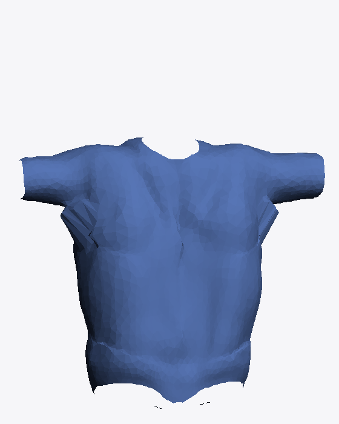
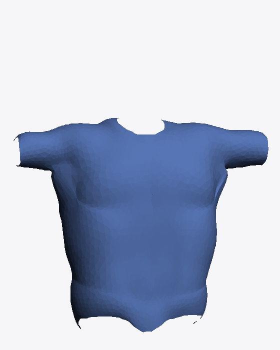

# Known issues

Tracked findings that are confirmed real but intentionally **not fixed yet** —
either out of scope for the session that found them, or needing more
validation before touching a shipped path. Each entry states exactly what's
confirmed, what isn't, and what has to be true before work starts.

---

## Tee: push-out terracing at the armpit (Pipeline 2, live in production)

**Status: confirmed, not started. No shipped code changed.**

### What's confirmed

While root-causing a visible fine-wrinkling defect in the pants category
(Phase 2), the cause turned out to be generic, not pants-specific:
`resolve_interpenetration()` (`app/garment.py`) pushes any garment vertex
that's inside the body back out along the local face normal, snapping each
vertex **independently** to its own nearest body point with zero averaging
against its neighbours. In a concave region, vertices right at the
push/no-push boundary land at visibly different depths than their
neighbours, which reads as a stack of fine ridges.

The tee's shallow torso mostly hides this. Its armpit — the tee's own
concave region, the direct analogue of the pants crotch — does not. Testing
the tee's own documented worst case (`docs/physics-drape-pipeline.md` §3.1:
"a slim body wearing the largest size") by reconstructing exactly what
`app/physics_drape.py`'s `PhysicsDraper.drape()` builds at runtime:

| Current live output | Kinematic-only, +1 smooth pass (proves the diagnosis) | Runtime-only patch + the *existing* baked delta |
|:---:|:---:|:---:|
|  |  |  |
| visible fan/pleat ridges under both arms | ridge fully gone | improved (mean vertex shift ≈ **3.5mm**), not fully clean |

This is a **live product defect**, not a backlog item — the first column is
what a real customer with this body/size combination sees today.

**Caveat added after later verification:** the renders above were produced
by a hand-rolled flat-shaded rasterizer later found to exaggerate this exact
class of concave-region artifact (see the retracted entry below). Re-checked
with a proper smooth-shaded Cycles render on the pants equivalent of this
bug: the fix **is** a real, visible improvement under reliable rendering too,
and the rendering-independent evidence (vertices topologically crossing to
the wrong side) never depended on the rasterizer at all — but the severity
shown above is likely overstated. Worth a Cycles re-render before treating
this as fully characterized.

### Why it isn't simply "fixed"

The tee's 125-point delta library (`models/garments/tshirt_physics/delta_library.npz`)
stores `delta = physics_baked − kinematic_fit`, computed once, offline,
against the **current, un-smoothed** kinematic baseline. Patching only the
runtime kinematic reconstruction in `physics_drape.py` (mirroring the fix
already applied to `dress_pants()`) measurably helps — but it doesn't fully
clean the ridge, because the pre-baked delta was calibrated against the old,
un-fixed geometry and doesn't "know about" the new baseline.

### Two options, neither started

- **Option A — runtime-only patch.** Add the same extra `smooth_garment()`
  pass to `physics_drape.py`'s kinematic reconstruction. Cheap, ships
  immediately. Confirmed **better, not clean** at the one worst-case point
  tested above.
- **Option B — full fix.** Re-bake the entire tee delta library from the
  corrected kinematic pipeline. Actually clean, but a full offline re-bake of
  a shipped, proven asset (125 physics sims, ~2hr per
  `docs/physics-drape-pipeline.md`) — real time cost and real risk to
  something currently working.

### What has to happen before Option A is even a candidate

Option A was only tested at the single worst-case grid point (loosest size,
slimmest body — maximum push-out activity). It has **not** been tested
against sizes/bodies where today's output is already fine. A patch that
measurably shifts every vertex by ~3.5mm at the worst case will shift
*every* grid point's reconstructed kinematic baseline by some amount, and
that baseline is added to a delta that was never computed against the new
baseline anywhere in the grid — not just the worst case. Before Option A is
treated as viable, it needs a pass across a representative spread of grid
points (tight sizes, slim-to-large builds, short-to-tall heights) comparing
old-patch vs. new-patch output, specifically checking whether currently-fine
combinations regress.

This is planned as its own piece of work, separate from the pants Phase 2
track that found it.

---

## Retracted: `resample_boundary()` "crotch bulge" — was a rasterizer artifact, not a real defect

**Status: retracted after further verification. No code changed (a fix was**
**briefly added, then reverted once the underlying premise failed).**

This entry originally claimed `resample_boundary()`'s interior relaxation
over-smooths the pants crotch into a visible bulge, isolated stage-by-stage
through the carve pipeline, with the tee confirmed unaffected (that call-graph
finding — `resample_boundary()` is only ever invoked by
`extract_relaxed_pants.py`, never by any tee path — is the one part of this
that's still true and worth keeping in mind, even though the bug it was
guarding against turned out not to exist).

A fix was implemented (protect crotch vertices from the relaxation via a
distance-weighted blend back to their pre-relaxation position) and, after two
wrong guesses at *where* the bulge peaked, a third attempt did land on the
correct high-delta region — but rendering the result still showed the same
"bulge." That was the tell. Every render in this investigation, including all
of Phase 2's stiffness/pose/taper sweeps, had been produced by a hand-rolled
software rasterizer (flat per-face shading, one directional light — built
originally because live Blender/EEVEE rendering hit black-screen issues
early in Phase 0). Checking directly: numeric curvature analysis (each
vertex's deviation from its neighbours' average position) showed only
2-4mm local deviation at the "bulge" — far too small to be the dramatic
convex lump the rasterizer was showing. A proper smooth-shaded Cycles render
of the exact same bare mesh confirmed it: **the crotch is genuinely,
correctly concave.** No bulge, no defect, nothing to fix. The flat-shaded
rasterizer was producing a misleading visual impression at this specific
kind of sharp concave transition, unrelated to the actual geometry.

The crotch-protection code that had been added to
`tools/drape_bake/extract_relaxed_pants.py` was reverted — it was solving a
problem that didn't exist, and leaving speculative fixes for phantom bugs
in an authoring script is worse than having no fix at all.

### Why this matters beyond this one finding

The push-out terracing bug above (armpit/crotch ridges from
`resolve_interpenetration()`) was diagnosed using the same rasterizer. Spot
checked with a proper Cycles render for direct comparison: that one **is**
real — the fixed mesh is visibly smoother than the unfixed one under
reliable shading too — but noticeably **less severe** than the rasterizer's
dramatic dark ridge-stack made it look. The underlying mechanism (independent
per-vertex snapping in `resolve_interpenetration()`) and the
rendering-independent numeric evidence for it (vertices genuinely crossing to
the other leg's side, measured by topology, not pixels) both still hold — only
the *visual severity* was overstated. Anything in this session judged purely
by eye through that rasterizer (the stiffness sweep's "fine wrinkling"
comparisons in particular) should be treated as directionally suggestive,
not settled, until re-checked the same way.

---

## Pants: crotch-bridge droop, both genders (Phase 0 template, kinematic fit)

**Status: confirmed real, not fixed. Accepted as known for both genders;
proceeding with baking regardless. Distinct from the "crotch bulge" entry
above** — that one was a rendering artifact from a discredited rasterizer,
retracted after a proper Cycles render showed no defect. This one is measured
directly on vertex positions and mesh topology, not by eye, and holds.

### What's confirmed

A band of garment fabric hangs below the body's actual crotch point, with
mesh edges topologically bridging across the centreline in the gap between
the legs — real, not a rendering artifact:

| body | droop (mm) | bridging edges below crotch |
|---|---:|---:|
| male, average | 145–191 | 28–53 (varies by grid point) |
| female, β=0 (seat_ease=1.15, current template) | 178 | 32 |

Measured by: fitting the template through the exact kinematic fit
(`run_pilot_batch.kinematic_fit`), locating the body's true crotch height
(lowest point of a narrow band near the centreline, between 35–65% body
height), then checking (a) how far below that height any centreline-band
garment vertex sits, and (b) whether any mesh edge connects a vertex with
positive X to one with negative X at a height below the crotch line. Confirmed
present in the **kinematic fit alone**, before any physics runs — this is a
template/carve-stage defect, not something the cloth sim introduces.

### What's NOT confirmed

- Root cause within the carve pipeline (which stage introduces the bridge)
  has not been isolated for either gender this session.
- Whether the defect's severity changes materially after physics (a partial
  runtime-correction prototype was attempted for male — see the crotch-fix
  prototype script — and left unresolved: it reduced droop but oscillated
  rather than converging to zero bridging edges; not applied anywhere).
- Whether female's `seat_ease=1.15` change affected the droop at all
  (measured before and after: 188mm before, 178mm after — within the range
  of noise/different query point, not evidence the seat push-out touches
  this region; `seat_ease`'s mask is `y >= crotch_y`, entirely above where
  the bridging happens).

### Decision

Bake both genders with this defect open, matching the precedent already set
for male's production bake. Reassess after baking whether physics changes it
materially, same open items as above.

---

## Pants: 12 non-converging grid nodes, all in body builds 2 and 3 (Phase 3 bake)

**Status: confirmed and characterised, not fixed. No shipped code changed,
no recipe changed, `grid125_manifest.json` untouched.**

### What's confirmed

The 125-point production bake (`tools/drape_bake/phase4_grid_pants.py`,
`CLOTH_QUALITY=60`) completed 125/125 with zero crashes: **113 converged, 12
caught by the convergence guard**. The 12 guard-skips are not scattered — they
fall in **exactly two of the five body builds**, and in no others:

| build | body (wt, chest, waist, hips) | converged | guard-skipped |
|:--|:--|--:|--:|
| 0 slim | 58, 86, 74, 88 | 25 | 0 |
| 1 | 75, 98, 86, 100 | 25 | 0 |
| **2** | **92, 110, 98, 112** | 20 | **5** |
| **3** | **108, 122, 110, 124** | 18 | **7** |
| 4 heavy | 125, 134, 122, 136 | 25 | 0 |

**Ease is not the discriminator.** The 12 span all three fit bands — 9
too-small (−34 to −10cm ease), 1 snug (`g221`, +2cm), 2 loose (`g433`/`g434`,
+14cm). A node with 36cm more garment room fails the same way as a badly
undersized one. What the failures share is the body underneath, not the fit.

**The failures are bimodal, not marginal.** Build 3 has the *best* median
residual of any build (0.098mm, vs 0.216mm for the failure-free build 0) while
carrying 7 of the 12 failures, and **no node anywhere in the 125 needed a
retry**. There is no gradual degradation and no band of near-threshold nodes:
a node either settles cleanly or blows up. This points at a discrete trip
rather than a continuously mis-set stiffness or damping value.

**The bake is bit-deterministic.** All 6 re-baked nodes (`g133`, `g134`,
`g433`, `g434`, `g020`, `g021`) reproduced their originals exactly —
`np.array_equal` on all 4815 vertices is `True`, max difference `0.000e+00`,
same `frames_run` and `retries_used`. Verified against copies preserved in
`tools/drape_bake/_prebake_backup/`. **A same-recipe re-bake is therefore a
proven no-op**; recovering these nodes requires changing something.

### The oscillation signature (per-vertex diagnostic, `LOG_PER_VERTEX=1`)

All 6 diagnosed nodes share one signature, across both the too-small and
loose bands:

| node | band | ease | >1mm | hem | knee | crotch | waist | crotch/rest |
|:--|:--|--:|--:|--:|--:|--:|--:|--:|
| g020 | too-small | −22 | 100.0% | 7.74 | 10.77 | 13.54 | 8.36 | 1.51× |
| g021 | too-small | −22 | 86.5% | 1.76 | 2.98 | 4.30 | 1.46 | 2.08× |
| g133 | too-small | −22 | 95.2% | 3.99 | 7.13 | 7.86 | 4.77 | 1.48× |
| g134 | too-small | −22 | 79.8% | 2.09 | 3.42 | 5.28 | 1.75 | 2.18× |
| g433 | loose | +14 | 99.1% | 2.15 | 3.22 | 6.81 | 3.83 | 2.22× |
| g434 | loose | +14 | 97.6% | 2.92 | 6.32 | 9.53 | 6.48 | 1.82× |

(mean per-vertex oscillation in mm by height band; `>1mm` = fraction of all
4815 vertices oscillating above 1mm at the end of the run)

**The crotch seam is the epicentre, but the blow-up is global.** Both halves
of that sentence are load-bearing:

- *Epicentre*: ranking vertices by oscillation normalised per-node and
  averaged across all 6, **38 of the top 40 sit in the crotch/upper-thigh
  band** (height fraction 0.55–0.80), with a median distance from the
  centreline of **2.1mm** — versus 132mm for the mesh as a whole. They are
  sitting on the crotch seam itself. The inner-thigh subset (727 vertices,
  height fraction 0.55–0.80 and within 6cm of the centreline) oscillates at
  **2.05×** the whole-garment mean.
- *Global*: **80–100% of all vertices** exceed 1mm, the top 40 carry only
  2.8–5.3% of total motion, and every node ran the full 90-frame retry
  extension without settling. A locally-confined problem would show a hot
  crotch and a quiet hem; here the calmest region still runs 1.5–7.7mm.

Consistently-worst vertex indices (top 40 by normalised mean across all 6):

```
332, 355, 356, 434, 435, 539, 954, 971, 1050, 1051, 2063, 2076, 2077, 2078,
2079, 2080, 2410, 2411, 2412, 2413, 2414, 2416, 2760, 2761, 2762, 3843, 3844,
3845, 3892, 3895, 3907, 3908, 3909, 4236, 4237, 4238, 4239, 4240, 4241, 4245
```

Region masks used above, reproducible from any bake output:
height fraction `t = (y - y.min()) / (y.max() - y.min())`; crotch/upper-thigh
band `0.55 <= t < 0.80`; inner-thigh subset additionally `|x| < 0.06` m.

### The 12 hole coordinates and their chain structure

Node names are `g{size}{build}{height}`, all indices 0-4.
Size = garment flat waist `[38, 44, 50, 56, 62]` cm.
Height = `[162, 169, 175, 181, 188]` cm. Ease = `2 x garment_waist - body_waist`.

| node | size | build | height | ease | band | chain |
|:--|--:|--:|--:|--:|:--|:--|
| g020 | 0 (38) | 2 | 0 (162) | −22 | too-small | **A** |
| g021 | 0 (38) | 2 | 1 (169) | −22 | too-small | **A** |
| g121 | 1 (44) | 2 | 1 (169) | −10 | too-small | **A** |
| g221 | 2 (50) | 2 | 1 (169) | +2 | snug | **A** |
| g034 | 0 (38) | 3 | 4 (188) | −34 | too-small | **B** |
| g133 | 1 (44) | 3 | 3 (181) | −22 | too-small | **B** |
| g134 | 1 (44) | 3 | 4 (188) | −22 | too-small | **B** |
| g234 | 2 (50) | 3 | 4 (188) | −10 | too-small | **B** |
| g433 | 4 (62) | 3 | 3 (181) | +14 | loose | **C** |
| g434 | 4 (62) | 3 | 4 (188) | +14 | loose | **C** |
| g031 | 0 (38) | 3 | 1 (169) | −34 | too-small | isolated |
| g124 | 1 (44) | 2 | 4 (188) | −10 | too-small | isolated |

Under 6-connectivity in (size, build, height) index space the 12 form three
connected components plus two isolated nodes:

- **Chain A** — `g020 - g021 - g121 - g221`. One step in height
  (g020→g021), then two steps in size (g021→g121→g221). All in build 2.
- **Chain B** — `g034 - g134 - g234` across size with `g133 - g134` in
  height: a T with `g134` at the junction. All in build 3.
- **Pair C** — `g433 - g434`, one step in height. Build 3.
- **Isolated** — `g031`, `g124`.

`g021` and `g134` have no fully-bracketed axis (no axis with a converged
neighbour on both sides) and can only be extrapolated, not interpolated.

### Neighbour-fill sources (all reads are from converged nodes only)

The fill never reads a filled value, so it is order-independent — there is no
sequence in which one hole's estimate could contaminate another's. Sources
per hole, where "bracketed" means the mean of two converged neighbours on
opposite sides of an axis (estimates from multiple axes are averaged), and
IDW means inverse-distance-squared over converged nodes within Manhattan
distance 2:

| hole | method | sources |
|:--|:--|:--|
| g020 | bracketed (build) | g010, g030 |
| g021 | **IDW** | d=1: g011, g022 · d=2: g001, g010, g012, g023, g030, g032, g041, g111, g120, g122, g131 |
| g121 | bracketed (build, height) | g111, g131, g120, g122 |
| g221 | bracketed (build, height) | g211, g231, g220, g222 |
| g034 | bracketed (build) | g024, g044 |
| g133 | bracketed (size, build) | g033, g233, g123, g143 |
| g134 | **IDW** | d=1: g144 · d=2: g024, g033, g044, g114, g123, g132, g143, g224, g233, g244, g334 |
| g234 | bracketed (build) | g224, g244 |
| g433 | bracketed (build) | g423, g443 |
| g434 | bracketed (build) | g424, g444 |
| g031 | bracketed (height) | g030, g032 |
| g124 | bracketed (size) | g024, g224 |

`g134` is the weakest fill in the grid: a single converged neighbour at
distance 1 (`g144`), everything else at distance 2.

**There is no cascade, not even one level.** The fill is single-stage: every
hole is estimated in the same pass, reading only the converged mask. A hole is
never populated first and then read as a source for another hole. Chain B is
the case where a cascade would show up if one existed, and it demonstrably
does not — `g034` and `g234` are both within range of `g133` (distance 2) and
`g134` (distance 1), so a naive "average the 6 grid-neighbours" fill *would*
pull them in, but both are skipped because they are holes:

| would-be source | target | distance | in range? | converged? | used? |
|:--|:--|--:|:--|:--|:--|
| g034 | g133 | 2 | yes | no | **no** |
| g234 | g133 | 2 | yes | no | **no** |
| g034 | g134 | 1 | yes | no | **no** |
| g234 | g134 | 1 | yes | no | **no** |

Every source in the table above is a real baked node. `g133` is filled from
four converged neighbours at distance 1 — `g033`/`g233` on the size axis
(both build 3) and `g123`/`g143` on the build axis (builds 2 and 4). `g134`
is filled from twelve converged nodes, one at distance 1 (`g144`, build 4)
and eleven at distance 2. Weight contributed by any filled value, anywhere in
the grid: **zero**.

### What is NOT confirmed

- **`g020`/`g021` are not "extreme too-small" failures.** The extreme
  too-small corner converges cleanly: ease −46cm (`g040`-`g044`) passes 5/5
  at 0.10-0.12mm, and ease −34cm passes 8/10. `g020`/`g021` sit at −22cm —
  nodes with more than twice their fabric tension settle without trouble.
  Fit severity does not predict failure. What they actually are is a
  **build-2 / size-0 / short-height instability of unknown cause**, and any
  explanation framed around extreme tension is contradicted by the grid.
- **No fix has been tried.** No lever (substeps, damping, mass, stiffness,
  collision margin, pose) has been swept against these 12 nodes. The
  "discrete trip" reading is an inference from the bimodality and the
  signature, not a tested mechanism.
- **Why builds 2 and 3 specifically** is unexplained. They are the two
  interior builds; both grid extremes are failure-free at every ease level
  tested, including the most extreme too-small case (−46cm, 5/5 pass). That
  non-monotonicity is unaccounted for.
- **Whether one change covers all 12.** The shared signature across the
  too-small and loose bands suggests one mechanism, but that is a hypothesis
  drawn from 6 of 12 nodes.

### What has to be true before work starts

- Any fix scoped to specific builds or grid cells is a **conditional branch
  on body build**, and needs explicit sign-off before it is written — the
  same bar applied to every other regime-specific fix in this pipeline.
- Substeps in particular is known to behave **non-monotonically** near this
  stability boundary (`g334` passed at q50, failed at q55, passed at q60,
  all reproducible). Any substeps-based fix must be validated against all 12
  failures and regression-checked against the 113 passing nodes, not spot-
  checked on one or two.
- A recipe change means **re-baking the whole grid, not just the 12 holes**.
  Mixing recipes across grid nodes would make the delta library interpolate
  between two different physics rather than between two body shapes.

### Interim state

The grid ships as-is with 12 documented holes filled from neighbours.
Measured cost of that fill (leave-one-out / leave-cluster-out against the
real cluster shapes, no re-baking): **2.77mm median** per-vertex error for a
clustered hole versus **2.40mm** for an isolated one — clustering costs about
0.4mm. For reference, adjacent converged nodes naturally differ by 4.32mm
(median), and the tee's accepted interpolation holdout range is 0.7–2.6mm.
The 12 holes form 3 connected chains (4-node, 4-node T-shaped, 2-node) plus
2 isolated nodes; `g021` and `g134` have no fully-bracketed axis and can only
be extrapolated, measured at 2.69mm and 2.96mm respectively.

---

## Pants: female grid — 17 non-converging nodes, both heaviest builds, low/mid heights only

**Status: confirmed and characterised at the same level as the male 12-hole
entry above, not fixed. Full 125-point grid completed
(`grid125_female_manifest.json`), 0 crashes. Supersedes the pilot-stage
single-point entry this section used to contain — the pilot's one failure
(`h165_s50_bheavy`) was an early, correct signal of this exact pattern, not
an isolated fluke.**

### What's confirmed

125/125 completed with zero crashes: **103 converged cleanly, 5
converged-after-extend (real, usable data), 17 caught by the convergence
guard with no usable result.** Crossed-leg violations: **0/125**, including
every guard-skipped node. Total wall time 7.24 hours (avg 208.5s/point).

The 17 holes + 5 extends are, once again, concentrated in specific builds —
even more sharply than male's pattern:

| build | body (wt, chest, waist, hips) | converged | extend | failed |
|:--|:--|--:|--:|--:|
| 0 slim | 52, 86, 60, 92 | 25 | 0 | 0 |
| 1 | 65, 92, 74, 100 | 25 | 0 | 0 |
| 2 (real, Phase1 stress) | 78, 98, 88, 108 | 25 | 0 | 0 |
| **3** | **91, 104, 102, 116** | 16 | **2** | **7** |
| **4 heavy** | **98, 108, 112, 120** | 12 | **3** | **10** |

Builds 0-2 are perfect, 75/75. Builds 3-4 alone carry all 22 problem nodes —
a 22/50 = 44% guard-skip rate in exactly the two heaviest builds, nothing
elsewhere. This matches male's own finding that the failures track a
specific body, not a specific fit.

**Ease is not the discriminator, same as male.** The 17 hard failures span
the full fit range, from -36cm (badly too-small) to +22cm (very loose):
`gf030`(-26) `gf040`(-36) `gf041`(-36) `gf130`(-14) `gf140`(-24) `gf141`(-24)
`gf230`(-2) `gf231`(-2) `gf240`(-12) `gf242`(-12) `gf330`(+10) `gf331`(+10)
`gf340`(0) `gf341`(0) `gf430`(+22) `gf440`(+12) `gf441`(+12).

**New pattern, not present in male's data: every failure and every extend is
at a low/mid height node.** All 22 problem nodes (17 failed + 5 extend) sit
at height_idx 0, 1, or 2 (151/158/165cm) — **zero at height_idx 3 or 4
(172/179cm)**, despite build/size being identical across height for a given
size/build pair. A build-4/size-38 body fails at 151cm and 158cm
(`gf040`/`gf041`) but converges cleanly at 172cm and 179cm — same body shape
targets, same garment, only height differs. Male's 12-hole write-up above
does not report this height-restriction; whether that's because male's
pattern genuinely doesn't have it, or because it wasn't checked for, is not
established.

### What's NOT confirmed

- Root cause — same open question as male's 12 holes: why heavy builds
  specifically, and why (new for female) only at lower heights within those
  builds.
- Whether the height-restriction is a real mechanism (e.g. a shorter+heavier
  body concentrates more starting interpenetration in the same crotch/thigh
  region) or a grid-density coincidence — not tested against intermediate
  heights.
- Not compared against male's per-vertex oscillation diagnostic
  (`LOG_PER_VERTEX=1`) — no per-vertex signature has been pulled for any of
  the 17 female failures.
- Bit-determinism of the female bake (male's 12 were confirmed to re-bake
  byte-identical) has not been re-checked for female.

### Decision (superseded — see Resolution below)

Accept as 17 holes, fill from converged neighbours using the exact same
single-pass, no-cascade fill `phase4_extract_pants.py` already implements
for male (now gender-parameterised — `--gender=female` writes to
`models/garments/pants_physics_female/`). No investigation beyond what's
documented here before extraction. Revisit if holdout validation (Phase 4)
shows the female fill cost is materially worse than male's measured
2.40mm/2.77mm.

### Resolution — root cause found for the height-restriction, 3 of 17 holes recovered

**Root cause: pose angle, not garment/carve.** `LOG_PER_VERTEX=1` re-bakes of
two failing nodes (`gf040` build 3, `gf030` build 4) showed the same
epicentre signature male's 12 holes have: 100% of the top-40 oscillating
vertices sit in the crotch/upper-thigh band (height fraction 0.55-0.80),
within a few mm of the centreline against a ~177mm whole-garment median. A
competing hypothesis (short bodies have less vertical slack between the
waistband pin and the crotch, so `waist_rise` or a similar waistband change
might fix it) was tested and **directly contradicted**: measured pin-to-crotch
distance is *larger* at short heights, not smaller (49.0cm at 151cm vs.
37.6cm at 179cm, same build). The actual fix targets the diagnosed region
instead: `POSE_HIP_ABDUCTION_RAD`, which directly controls inner-thigh
clearance. Widening it from male's baseline 6.9° to 8.0° for short-height
female nodes (build-independent — this was tested and build index alone
does NOT predict success, see below) converges most of them.

**3 of the 6 originally-failing "both h151+h158 hole" pivot nodes now
converge cleanly at 8.0°:**

| node | baseline (6.9°) | at 8.0° |
|---|---|---|
| gf141 (size44/build4/h158) | failed, 7.10mm | **converged-after-extend, 0.38mm** |
| gf231 (size50/build3/h158) | failed, 4.61mm | **converged, 0.10mm** |
| gf331 (size56/build3/h158) | failed, 13.17mm | **converged, 0.11mm** |

These are promoted into the real grid data (`grid125_female_manifest.json`,
`_pilot_outputs/`), tagged `pose_hip_abduction_deg: 8.0` for provenance.

**3 nodes tested at three angles (6.9°/7.5°/8.0°) each, none converge —
accepted as permanent holes:**

| node | 6.9° | 7.5° | 8.0° |
|---|---|---|---|
| gf041 (size38/build4/h158) | failed, 0.90mm | failed, 0.63mm | failed, 9.85mm (regressed) |
| gf341 (size56/build4/h158) | failed, 0.90mm | failed, 0.63mm | failed, 9.85mm (regressed) |
| gf441 (size62/build4/h158) | failed, 16.98mm | failed, 1.44mm | failed, 0.60mm (closest) |

Build index alone does **not** discriminate these from the 3 that converged
— `gf141` is build 4 (heaviest), same as all three permanent holes, and it
converged fine at 8.0°. What actually separates `gf041`/`gf341` from the
converging nodes: their bake inputs are **byte-identical** to each other
despite different nominal sizes (38 vs 56) — confirmed via direct diff of
`garment_verts`/`body_verts`/`pin_weights`. Both land on the exact same
*unadjusted* raw kinematic-fit garment: `gf041` (ease -36cm) trips the
`TOO_SMALL` guard so `apply_pants_looseness` never runs; `gf341` (ease 0cm)
does run it, but the computed diff is exactly 0.0cm (`radius=0.0mm,
mean|expansion|=0.0mm` — a real call that does nothing). Every node that DID
converge at 8.0° received a real, non-zero fabric adjustment first. `gf441`
got a real +12cm adjustment but still falls ~0.1mm short of the threshold at
its best angle — a distinct, still-unexplained near-miss, not the same
mechanism as the other two.

**Config, not session notes**
(`tools/drape_bake/phase4_grid_pants.py::pose_hip_abduction_deg()` +
`POSE_HIP_ABDUCTION_DEG` + `FEMALE_POSE_UNRESOLVED_NODES`, wired into
`run_pilot_batch.run_one_point` via each grid point's own
`pose_hip_abduction_deg` field): standard heights (172/179cm) → 6.9°, all
builds. Short heights (151/158/165cm) → 8.0°, all builds — build index does
not gate this, per the `gf141` counter-example above. `gf041`/`gf341`/`gf441`
(exact `(size_idx, build_idx, height_idx)` triples, not a general rule) are
listed as permanently unresolved; their recorded angle (8.0°) is the best
result found, not a working fix.

**Final hole count after re-extraction: 14, not 17** (111/125 converged +
extend). 13 of the 14 remaining holes are **not isolated** — they form one
connected 13-node component (the builds-3/4 × h151/h158 slab, now 3 nodes
smaller). Only `gf242` is isolated with a real 2-axis bracket. This does not
create a cascade risk: `fill_node()` reads only the original converged/extend
mask, never a previously-filled value, by construction — verified directly in
code, not assumed. It does mean 13 of the 14 fills fall back to the
distance-2 IDW estimate (typically sourced from build 2, a meaningfully
different, lighter body) rather than a tight local bracket, so expect higher
interpolation error for this cluster than male's isolated/small-chain holes.
